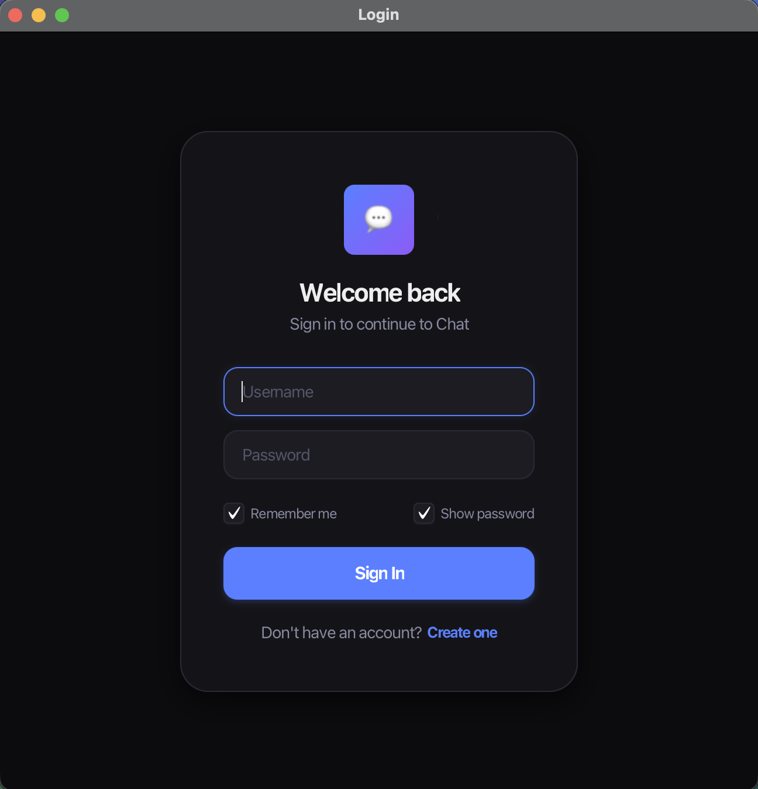
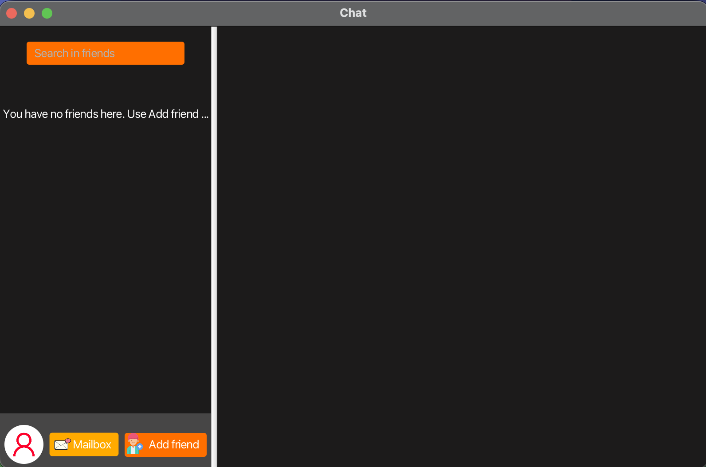
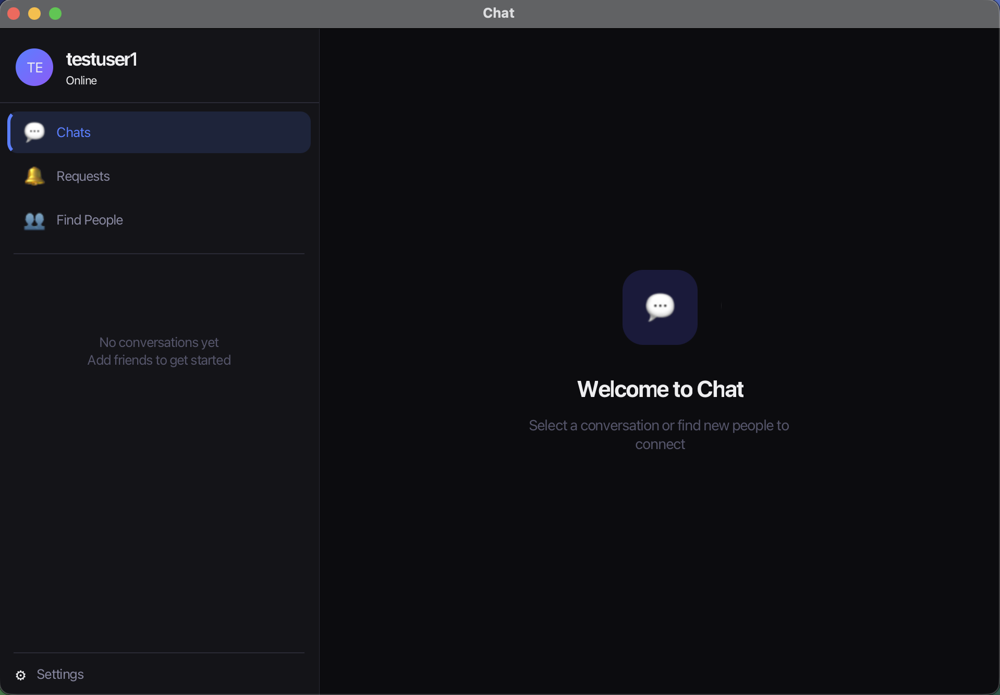
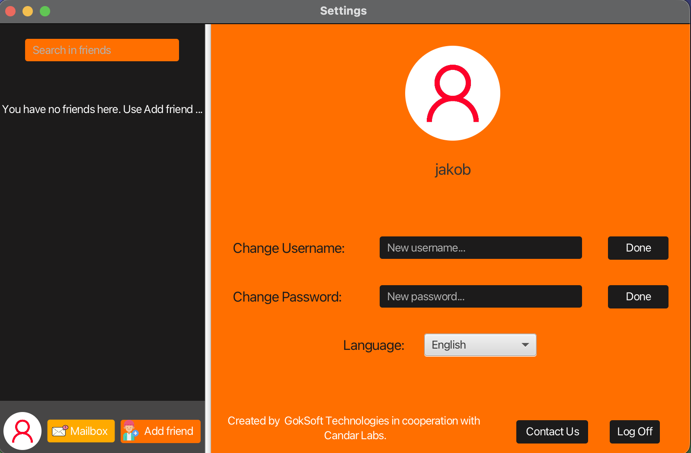
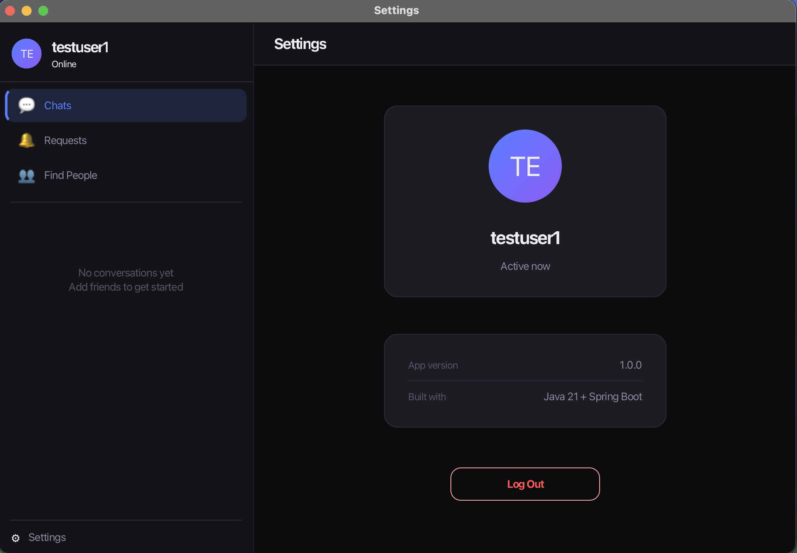
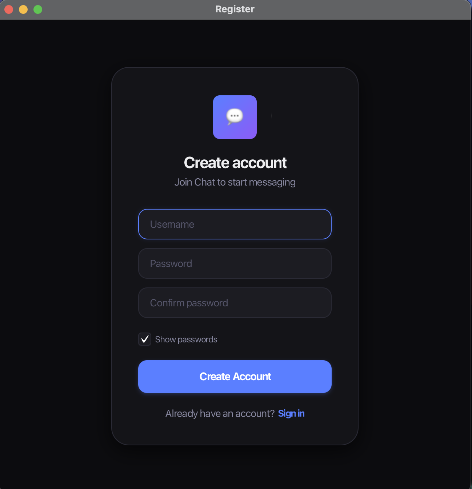
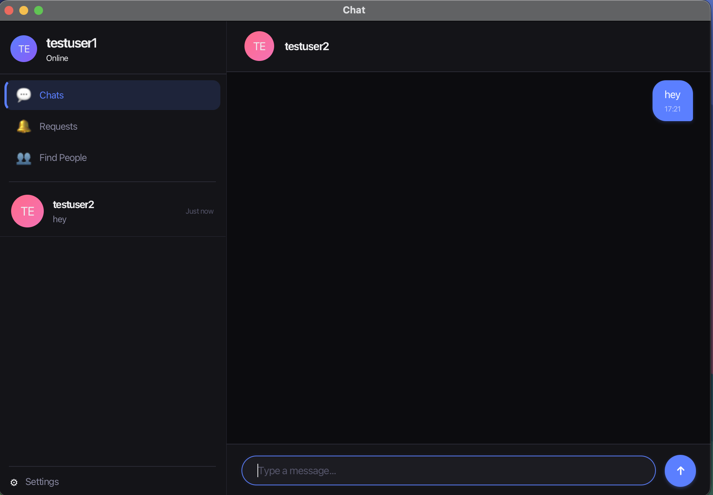

# Java-ChatApp

A modern desktop messaging application built with **Spring Boot** and **JavaFX**. Originally developed in 2020 with a PHP backend and MySQL database, this project has been completely modernized with a RESTful API architecture, JWT authentication, and a redesigned dark-theme UI.


---

## Download & Install

Pre-built installers are available on the [**Releases**](https://github.com/JakobGokpinar/Java-ChatApp/releases) page. Download the latest version for your platform:

### macOS (.dmg)

1. Download the `.dmg` file from Releases
2. Open the `.dmg` and drag the app to your **Applications** folder
3. On first launch, macOS will block it — go to **System Settings → Privacy & Security**
4. Scroll down and click **"Open Anyway"** next to the ChatApp warning
5. The app will launch — register an account and start chatting

### Windows (.msi)

1. Download the `.msi` file from Releases
2. Run the installer — if Windows Defender shows a warning, click **"More info" → "Run anyway"**
3. Follow the installation wizard
4. Launch ChatApp from the Start Menu or Desktop shortcut
5. Register an account and start chatting

### Usage

1. **Register** — Create an account with a username and password
2. **Login** — Sign in with your credentials (check "Remember me" to save your username)
3. **Find People** — Search for other users by username and send friend requests
4. **Chat** — Once a friend request is accepted, select them from the sidebar to start messaging

> **Note:** The app connects to a live backend — you'll need an internet connection. To chat with someone, both users need to have accounts and be friends.

---

## UI Redesign

The application went through a complete visual overhaul — from the original 2020 design to a modern dark theme inspired by Signal and Discord.

### Login

| Before | After |
|--------|-------|
|  |  |

### Main Chat

| Before | After |
|--------|-------|
|  |  |

### Settings

| Before | After |
|--------|-------|
|  |  |

### New Screens

| Register | Chat View |
|----------|-----------|
|  |  |

---

## Architecture

```
┌─────────────────────────────────────────────────────────┐
│                    JavaFX Frontend                       │
│  FXML Views → Controllers → Services → ApiClient (HTTP) │
└──────────────────────────┬──────────────────────────────┘
                           │ REST + JWT
┌──────────────────────────▼──────────────────────────────┐
│                 Spring Boot Backend                      │
│  Controllers → Services → Repositories → PostgreSQL      │
└─────────────────────────────────────────────────────────┘
```

**Backend** — Spring Boot REST API with JWT authentication, BCrypt password hashing, and Spring Data JPA. Deployed on Railway with PostgreSQL.

**Frontend** — JavaFX desktop client with a component-based UI, async HTTP services, and native installers (.dmg / .msi) built via GitHub Actions.

**Database** — 3 tables: `users`, `friendships` (with PENDING/ACCEPTED/REJECTED status enum), and `messages` (with `is_read` flag replacing the old notifications table).

---

## Tech Stack

| Layer | Technologies |
|-------|-------------|
| **Backend** | Java 21, Spring Boot 3, Spring Data JPA, PostgreSQL, JWT, BCrypt |
| **Frontend** | Java 21, JavaFX 21, Maven, CSS |
| **Deployment** | Railway (backend + DB), GitHub Actions (CI/CD), jpackage (native builds) |

---

## Features

- **Authentication** — Register, login, JWT token-based sessions, remember me
- **Friend System** — Send/accept/decline friend requests with real-time polling
- **Messaging** — One-to-one chat with timestamps and read tracking
- **User Search** — Find and add new friends by username
- **Modern UI** — Dark theme with indigo accent, gradient avatars, Signal-style message bubbles
- **Native Builds** — macOS `.dmg` and Windows `.msi` installers via GitHub Actions
- **Dev/Prod Environments** — Separate configurations for local development and production

---

## Getting Started

### Prerequisites

- Java 21+
- Maven
- PostgreSQL (for local development)

### Backend

```bash
cd backend
mvn spring-boot:run -Dspring-boot.run.profiles=dev
```

### Frontend

```bash
cd frontend
mvn javafx:run
```

The frontend defaults to the production backend. To connect to a local backend, run with `-Dapp.env=dev` (see `Environment.java` for configuration).

### Download

Pre-built installers for macOS and Windows are available on the [Releases](https://github.com/JakobGokpinar/Java-ChatApp/releases) page.

---

## Project Structure

```
Java-ChatApp/
├── backend/                          # Spring Boot REST API
│   └── src/main/java/com/chatapp/backend/
│       ├── controller/               # REST endpoints
│       ├── service/                  # Business logic
│       ├── repository/               # Spring Data JPA
│       ├── model/                    # JPA entities
│       ├── security/                 # JWT filter & config
│       └── config/                   # CORS, security config
│
├── frontend/                         # JavaFX desktop client
│   └── src/goksoft/chat/app/
│       ├── controller/               # FXML controllers
│       │   ├── auth/                 # Login, Register
│       │   ├── main/                 # Main panel
│       │   └── dialog/               # Warning dialogs
│       ├── service/                  # HTTP service layer
│       ├── ui/components/            # Reusable UI components
│       ├── config/                   # Environment config
│       ├── util/                     # Scene switching utils
│       └── view/                     # FXML layouts
│           ├── auth/                 # Login & register screens
│           ├── main/                 # Main panel layout
│           └── legacy/               # Original 2020 login design
│
└── .github/workflows/                # CI/CD pipeline
```

---

## Modernization Journey

This project started as a university exercise in 2020 and has been incrementally modernized:

| Phase | What Changed |
|-------|-------------|
| **Original (2020)** | PHP backend, MySQL, raw SQL, basic JavaFX UI |
| **Backend Migration** | Spring Boot, PostgreSQL, JPA, RESTful API |
| **Authentication** | JWT tokens replacing session-based auth, BCrypt passwords |
| **Database Redesign** | 5 tables → 3 tables, unified friendships with status enum |
| **Code Architecture** | Service layer, async HTTP client, dependency injection |
| **UI Redesign** | Modern dark theme, component-based UI, gradient avatars |
| **Deployment** | Railway hosting, GitHub Actions CI/CD, native installers |

---

## Legacy Repositories

The original codebase is preserved for reference:

- [Chat-App-Backend](https://github.com/JakobGokpinar/Chat-App-Backend) — Original PHP backend (archived)
- [Chat-App-Frontend](https://github.com/JakobGokpinar/Chat-App-Frontend) — Original JavaFX frontend with PHP integration (archived)

---

## Author

**Jakob Gokpınar** — BSc Informatics, University of Oslo

[](https://www.linkedin.com/in/jakob-gokpinar-646851238/)
[](https://jakobg.tech)

---

## License

This project is licensed under the MIT License — see the [LICENSE](LICENSE) file for details.
