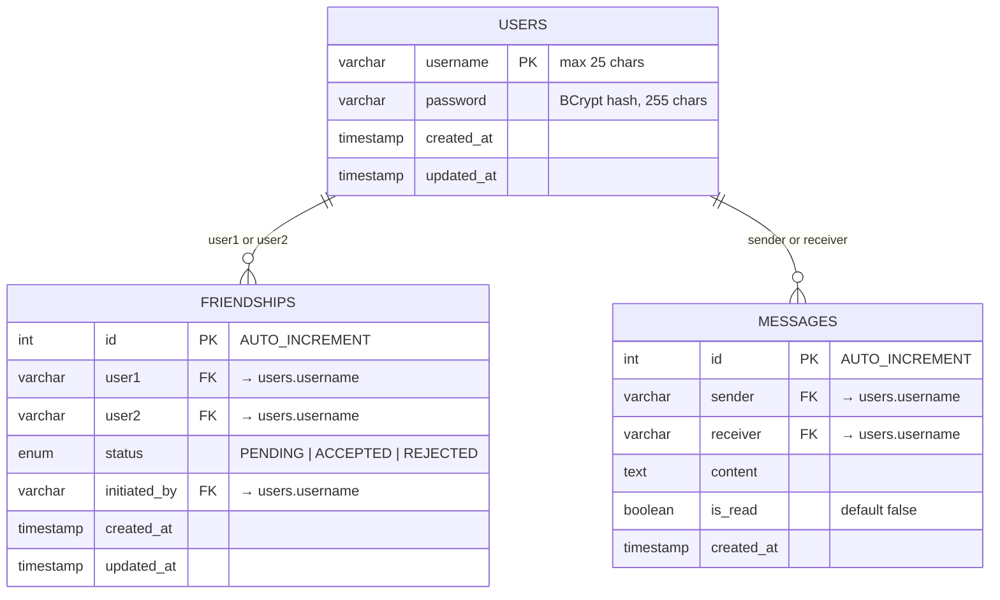
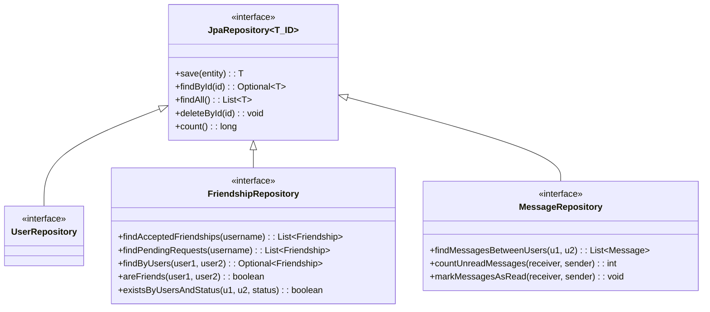
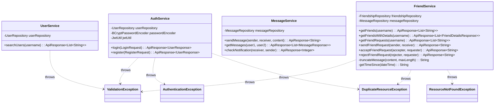
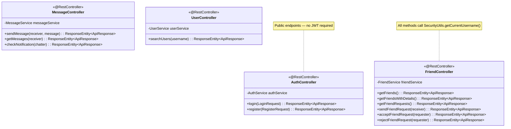
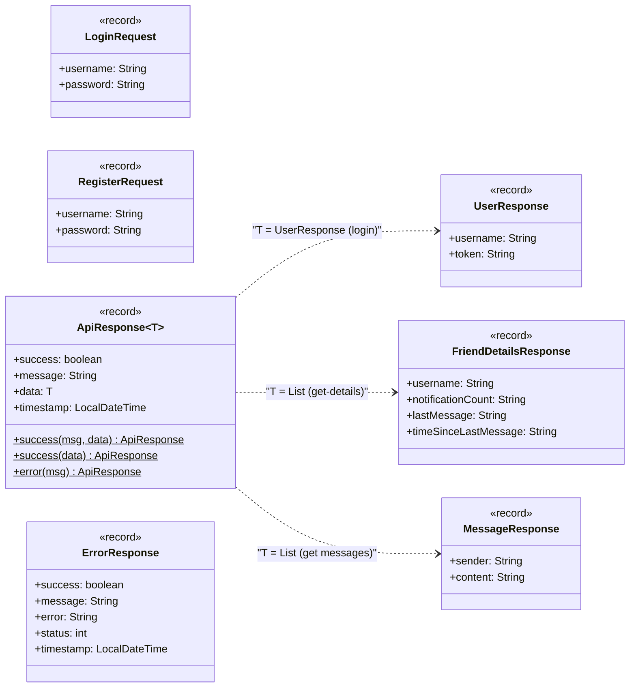
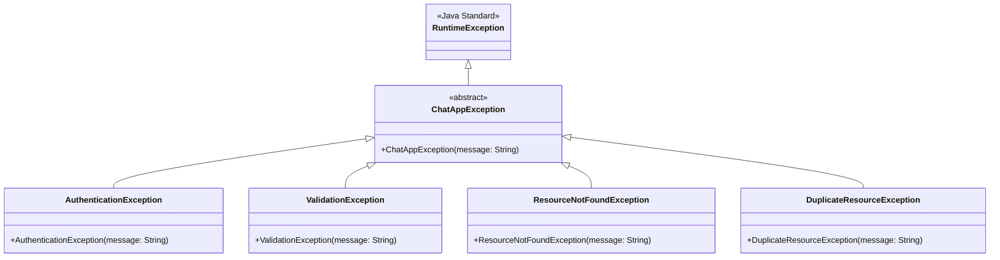
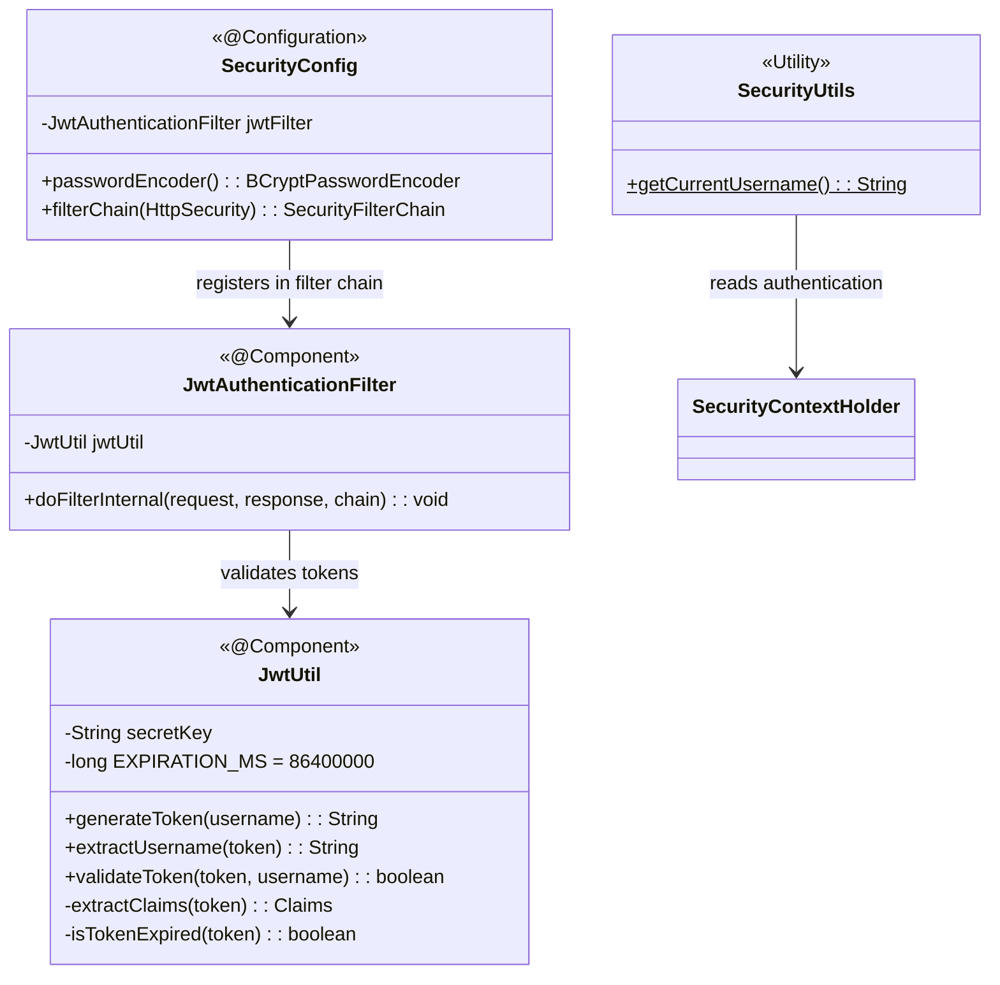
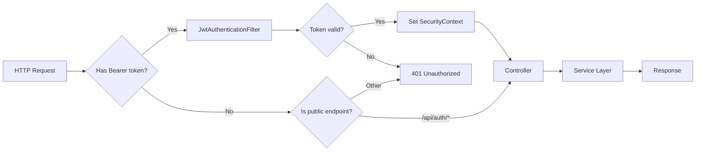
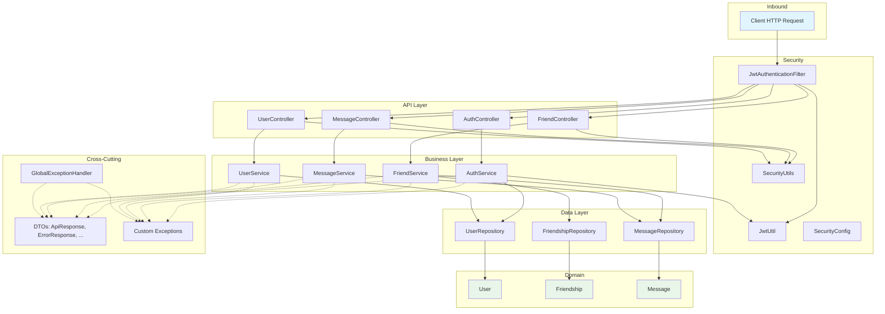

# Backend Class Diagram

## Overview

The backend consists of approximately 25 classes organized into 6 packages: `config`, `controller`, `dto`, `exception`, `model`, and `service`. This document provides a full class diagram followed by per-package breakdowns showing fields, methods, relationships, and annotations.

---

## Full System Class Diagram

```mermaid
classDiagram
    direction TB

    %% ── Entities ──
    class User {
        <<Entity>>
        -String username «PK»
        -String password
        -LocalDateTime createdAt
        -LocalDateTime updatedAt
        +getUsername(): String
        +getPassword(): String
        +setUsername(String)
        +setPassword(String)
    }

    class Friendship {
        <<Entity>>
        -Integer id «PK, AUTO»
        -String user1 «FK → users»
        -String user2 «FK → users»
        -FriendshipStatus status
        -String initiatedBy «FK → users»
        -LocalDateTime createdAt
        -LocalDateTime updatedAt
        +setStatus(FriendshipStatus)
        +getUser1(): String
        +getUser2(): String
        +getInitiatedBy(): String
    }

    class FriendshipStatus {
        <<Enumeration>>
        PENDING
        ACCEPTED
        REJECTED
    }

    class Message {
        <<Entity>>
        -Integer id «PK, AUTO»
        -String sender «FK → users»
        -String receiver «FK → users»
        -String content
        -Boolean isRead
        -LocalDateTime createdAt
        +getSender(): String
        +getReceiver(): String
        +getContent(): String
        +getIsRead(): Boolean
    }

    Friendship --> FriendshipStatus : status
    Friendship ..> User : user1, user2, initiatedBy
    Message ..> User : sender, receiver

    %% ── Repositories ──
    class UserRepository {
        <<Repository>>
        +findById(String): Optional~User~
        +existsById(String): boolean
        +findAll(): List~User~
        +save(User): User
    }

    class FriendshipRepository {
        <<Repository>>
        +findAcceptedFriendships(username): List~Friendship~
        +findPendingRequests(username): List~Friendship~
        +findByUsers(user1, user2): Optional~Friendship~
        +areFriends(user1, user2): boolean
        +existsByUsersAndStatus(u1, u2, status): boolean
        +save(Friendship): Friendship
    }

    class MessageRepository {
        <<Repository>>
        +findMessagesBetweenUsers(u1, u2): List~Message~
        +countUnreadMessages(receiver, sender): int
        +markMessagesAsRead(receiver, sender): void
        +save(Message): Message
    }

    UserRepository ..> User
    FriendshipRepository ..> Friendship
    MessageRepository ..> Message

    %% ── Services ──
    class AuthService {
        <<Service>>
        -UserRepository userRepository
        -BCryptPasswordEncoder passwordEncoder
        -JwtUtil jwtUtil
        +login(LoginRequest): ApiResponse~UserResponse~
        +register(RegisterRequest): ApiResponse~UserResponse~
    }

    class FriendService {
        <<Service>>
        -FriendshipRepository friendshipRepository
        -MessageRepository messageRepository
        +getFriends(username): ApiResponse~List~String~~
        +getFriendsWithDetails(username): ApiResponse~List~FriendDetailsResponse~~
        +getFriendRequests(username): ApiResponse~List~String~~
        +sendFriendRequest(sender, receiver): ApiResponse~String~
        +acceptFriendRequest(accepter, requester): ApiResponse~String~
        +rejectFriendRequest(rejecter, requester): ApiResponse~String~
    }

    class MessageService {
        <<Service>>
        -MessageRepository messageRepository
        +sendMessage(sender, receiver, content): ApiResponse~String~
        +getMessages(user1, user2): ApiResponse~List~MessageResponse~~
        +checkNotification(receiver, sender): ApiResponse~Integer~
    }

    class UserService {
        <<Service>>
        -UserRepository userRepository
        +searchUsers(username): ApiResponse~List~String~~
    }

    AuthService --> UserRepository
    AuthService --> JwtUtil
    FriendService --> FriendshipRepository
    FriendService --> MessageRepository
    MessageService --> MessageRepository
    UserService --> UserRepository

    %% ── Controllers ──
    class AuthController {
        <<RestController>>
        -AuthService authService
        +login(LoginRequest): ResponseEntity
        +register(RegisterRequest): ResponseEntity
    }

    class FriendController {
        <<RestController>>
        -FriendService friendService
        +getFriends(): ResponseEntity
        +getFriendsWithDetails(): ResponseEntity
        +getFriendRequests(): ResponseEntity
        +sendFriendRequest(receiver): ResponseEntity
        +acceptFriendRequest(requester): ResponseEntity
        +rejectFriendRequest(requester): ResponseEntity
    }

    class MessageController {
        <<RestController>>
        -MessageService messageService
        +sendMessage(receiver, message): ResponseEntity
        +getMessages(receiver): ResponseEntity
        +checkNotification(chatter): ResponseEntity
    }

    class UserController {
        <<RestController>>
        -UserService userService
        +searchUsers(username): ResponseEntity
    }

    AuthController --> AuthService
    FriendController --> FriendService
    MessageController --> MessageService
    UserController --> UserService

    %% ── Config ──
    class SecurityConfig {
        <<Configuration>>
        -JwtAuthenticationFilter jwtFilter
        +passwordEncoder(): BCryptPasswordEncoder
        +filterChain(HttpSecurity): SecurityFilterChain
    }

    class JwtAuthenticationFilter {
        <<Component>>
        -JwtUtil jwtUtil
        +doFilterInternal(request, response, chain): void
    }

    class JwtUtil {
        <<Component>>
        -String secretKey
        +generateToken(username): String
        +extractUsername(token): String
        +validateToken(token, username): boolean
    }

    class SecurityUtils {
        <<Utility>>
        +getCurrentUsername(): String$
    }

    SecurityConfig --> JwtAuthenticationFilter
    JwtAuthenticationFilter --> JwtUtil
    FriendController ..> SecurityUtils
    MessageController ..> SecurityUtils
    UserController ..> SecurityUtils

    %% ── DTOs ──
    class LoginRequest {
        <<record>>
        +username(): String
        +password(): String
    }

    class RegisterRequest {
        <<record>>
        +username(): String
        +password(): String
    }

    class ApiResponse~T~ {
        <<record>>
        +success(): boolean
        +message(): String
        +data(): T
        +timestamp(): LocalDateTime
        +success(message, data): ApiResponse$
        +error(message): ApiResponse$
    }

    class UserResponse {
        <<record>>
        +username(): String
        +token(): String
    }

    class FriendDetailsResponse {
        <<record>>
        +username(): String
        +notificationCount(): String
        +lastMessage(): String
        +timeSinceLastMessage(): String
    }

    class MessageResponse {
        <<record>>
        +sender(): String
        +content(): String
    }

    class ErrorResponse {
        <<record>>
        +success(): boolean
        +message(): String
        +error(): String
        +status(): int
        +timestamp(): LocalDateTime
    }

    AuthService ..> LoginRequest
    AuthService ..> RegisterRequest
    AuthService ..> UserResponse
    FriendService ..> FriendDetailsResponse
    MessageService ..> MessageResponse

    %% ── Exceptions ──
    class ChatAppException {
        <<abstract>>
        +getMessage(): String
    }
    class AuthenticationException
    class ResourceNotFoundException
    class ValidationException
    class DuplicateResourceException

    class GlobalExceptionHandler {
        <<ControllerAdvice>>
        +handleAuthenticationException(): ResponseEntity~ErrorResponse~
        +handleResourceNotFoundException(): ResponseEntity~ErrorResponse~
        +handleValidationException(): ResponseEntity~ErrorResponse~
        +handleDuplicateResourceException(): ResponseEntity~ErrorResponse~
        +handleGlobalException(): ResponseEntity~ErrorResponse~
    }

    ChatAppException <|-- AuthenticationException
    ChatAppException <|-- ResourceNotFoundException
    ChatAppException <|-- ValidationException
    ChatAppException <|-- DuplicateResourceException
    GlobalExceptionHandler ..> ErrorResponse
    GlobalExceptionHandler ..> AuthenticationException
    GlobalExceptionHandler ..> ResourceNotFoundException
    GlobalExceptionHandler ..> ValidationException
    GlobalExceptionHandler ..> DuplicateResourceException
```

---

## Package Breakdown

### model — JPA Entities

These classes map directly to database tables via Hibernate. The `username` field on `User` is the primary key (no auto-increment ID), while `Friendship` and `Message` use auto-generated integer IDs.

**Design notes:**

- `User` uses `username` as the primary key (`@Id` on a String field), not a numeric ID. This simplifies queries since most lookups and foreign keys reference usernames directly.
- `Friendship` stores both participants and uses a UNIQUE constraint on `(user1, user2)` to prevent duplicates. The `initiatedBy` field tracks who sent the request, enabling the "you can't accept your own request" business rule.
- `Message.isRead` replaced a separate notifications table from the original schema, reducing table count from 5 to 3.

---

### repository — Spring Data JPA

All repositories extend `JpaRepository`, which provides standard CRUD operations (`save`, `findById`, `findAll`, `delete`, `count`). Custom queries use `@Query` with JPQL.

`FriendshipRepository` is the most complex — all five custom queries handle the bidirectional nature of friendships (where the user could be either `user1` or `user2`). `MessageRepository.markMessagesAsRead()` uses `@Modifying` for a bulk UPDATE query within a `@Transactional` context.

---

### service — Business Logic

Each service handles one domain area. Services are the only layer that throws custom exceptions — controllers and repositories do not.

**Dependency map:**

- `AuthService` depends on `UserRepository` + `BCryptPasswordEncoder` + `JwtUtil` — the only service that touches security infrastructure.
- `FriendService` depends on both `FriendshipRepository` and `MessageRepository` — it needs message data to compute friend details (last message, unread count).
- `MessageService` and `UserService` each depend on a single repository.

---

### controller — REST Endpoints

Controllers are thin. Each method extracts the username from the JWT (via `SecurityUtils.getCurrentUsername()`), delegates to the service, and wraps the result in `ResponseEntity`. No business logic, no error handling — all of that lives in services and `GlobalExceptionHandler`.

---

### dto — Data Transfer Objects

All DTOs are Java 21 **records** (immutable, auto-generated equals/hashCode/toString). Request DTOs carry data from client to server. Response DTOs carry data from server to client. The `ApiResponse<T>` wrapper standardizes all successful responses.

**Why records?** Records produce 3 lines of code where a traditional class with constructors, getters, equals, hashCode, and toString would take 20+. They're immutable by default, which means DTOs can't be accidentally modified after construction.

---

### exception — Error Hierarchy

All custom exceptions extend `ChatAppException`, which extends `RuntimeException`. This keeps the exception hierarchy simple and allows Spring's `@ExceptionHandler` methods to catch them by type.

| Exception | HTTP Status | Error Code | Thrown When |
|---|---|---|---|
| `AuthenticationException` | 401 | `AUTHENTICATION_ERROR` | Invalid credentials, user not found during login |
| `ValidationException` | 400 | `VALIDATION_ERROR` | Missing fields, self-friend-request, already-processed request |
| `ResourceNotFoundException` | 404 | `RESOURCE_NOT_FOUND` | Friend request not found during accept/reject |
| `DuplicateResourceException` | 409 | `DUPLICATE_RESOURCE` | Username taken, already friends, pending request exists |
| Unhandled `Exception` | 500 | `INTERNAL_SERVER_ERROR` | Unexpected failures |

---

### config — Security Infrastructure

The security package manages JWT lifecycle and Spring Security configuration. The filter chain is: `JwtAuthenticationFilter → SecurityConfig → Controller`.

**Request processing order:**

---

## Dependency Flow

The complete dependency direction across all packages flows top-down. No layer depends on a layer above it.

