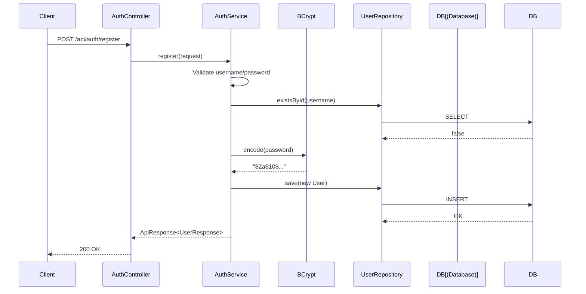
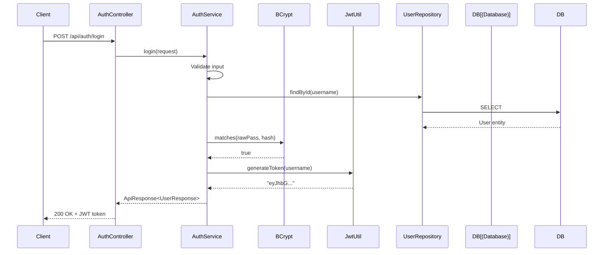
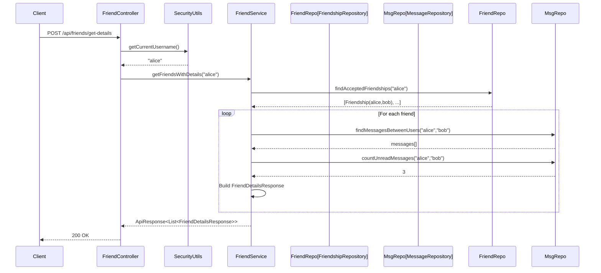
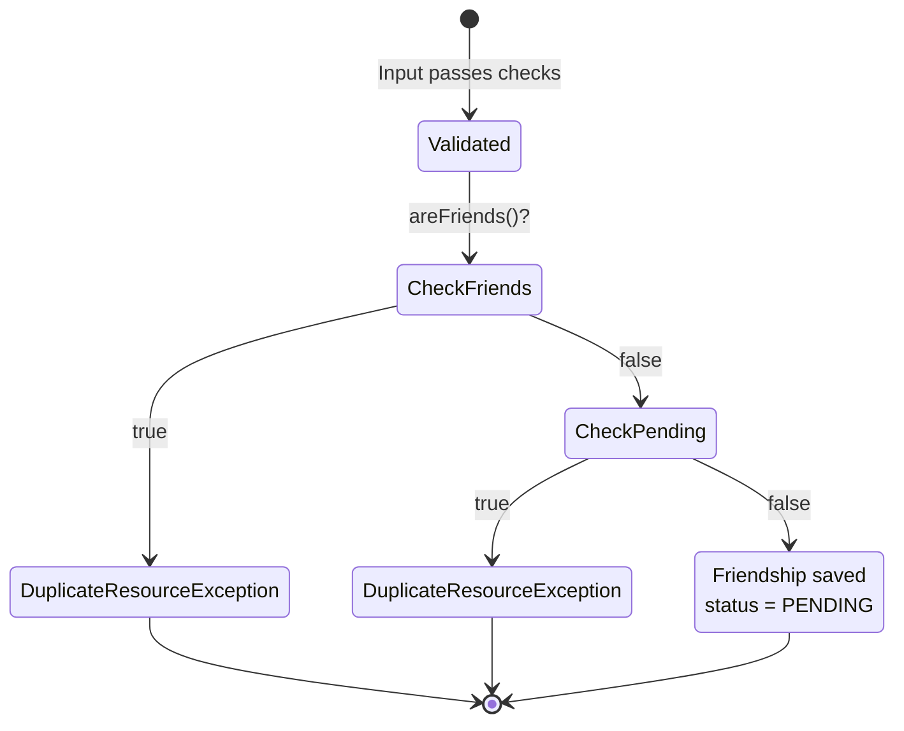
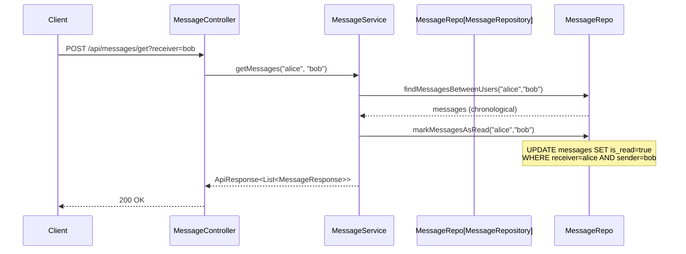
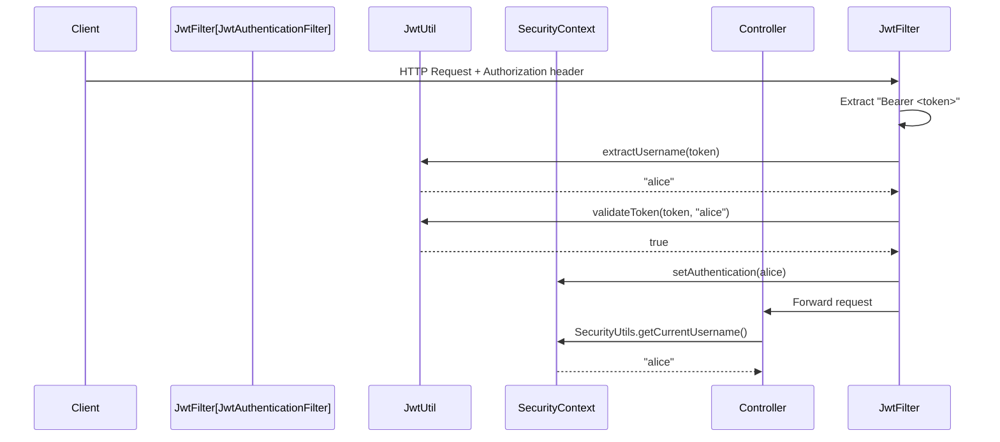
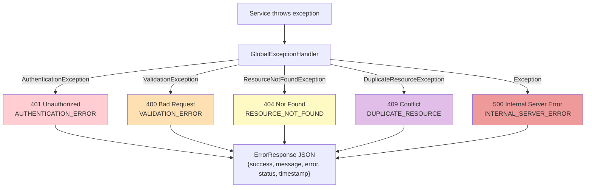

# Backend Use Case Diagram

## System Overview

The chat application backend exposes a REST API consumed by the JavaFX desktop client. There are two actor roles: **Unauthenticated User** (pre-login) and **Authenticated User** (post-login with valid JWT). The system boundary is the Spring Boot application; the database and JWT infrastructure are internal to the system.

---

## Use Case Diagram

```mermaid
graph TB
    subgraph Actors
        UA["👤 Unauthenticated User"]
        AU["👤 Authenticated User"]
    end

    subgraph "Chat Application Backend"
        subgraph Authentication
            UC1["Register Account"]
            UC2["Login"]
        end

        subgraph "Friend Management"
            UC3["View Friends List"]
            UC4["View Friends with Details"]
            UC5["View Pending Requests"]
            UC6["Send Friend Request"]
            UC7["Accept Friend Request"]
            UC8["Reject Friend Request"]
        end

        subgraph Messaging
            UC9["Send Message"]
            UC10["View Conversation"]
            UC11["Check Unread Count"]
        end

        subgraph "User Management"
            UC12["Search Users"]
            UC13["View Profile Photo"]
            UC14["Upload Profile Photo"]
        end

        subgraph "Cross-Cutting (System)"
            UC15["Validate JWT Token"]
            UC16["Extract Identity from Token"]
            UC17["Hash Password"]
            UC18["Handle Errors Globally"]
        end
    end

    UA --> UC1
    UA --> UC2

    AU --> UC3
    AU --> UC4
    AU --> UC5
    AU --> UC6
    AU --> UC7
    AU --> UC8
    AU --> UC9
    AU --> UC10
    AU --> UC11
    AU --> UC12
    AU --> UC13
    AU --> UC14

    UC2 -.->|includes| UC17
    UC1 -.->|includes| UC17
    UC6 -.->|extends| UC18
    UC7 -.->|extends| UC18
    UC10 -.->|includes| UC11

    UC3 -.->|includes| UC15
    UC9 -.->|includes| UC15
    UC15 -.->|includes| UC16

    style Authentication fill:#e8f5e9
    style Messaging fill:#e3f2fd
    style "Friend Management" fill:#fff3e0
    style "User Management" fill:#f3e5f5
    style "Cross-Cutting (System)" fill:#f5f5f5
```

---

## Use Case Details

### UC1 — Register Account

| Field | Description |
|---|---|
| Actor | Unauthenticated User |
| Endpoint | `POST /api/auth/register` |
| Preconditions | None |
| Input | `username` (min 3 chars), `password` (min 4 chars) |
| Main Flow | 1. Validate input fields are present and meet length requirements. 2. Check username is not already taken. 3. Hash password with BCrypt. 4. Create and persist new User entity. 5. Return success with UserResponse (username, no token). |
| Error Flows | **E1** Missing/blank fields → `ValidationException` (400). **E2** Username exists → `DuplicateResourceException` (409). |
| Postconditions | New user exists in database. User must login separately to obtain a JWT. |



---

### UC2 — Login

| Field | Description |
|---|---|
| Actor | Unauthenticated User |
| Endpoint | `POST /api/auth/login` |
| Preconditions | User account exists |
| Input | `username`, `password` |
| Main Flow | 1. Validate input fields are present. 2. Look up user by username. 3. Verify password against BCrypt hash. 4. Generate JWT token (24-hour expiry). 5. Return success with UserResponse (username + token). |
| Error Flows | **E1** Missing fields → `ValidationException` (400). **E2** User not found → `AuthenticationException` (401). **E3** Wrong password → `AuthenticationException` (401). |
| Postconditions | Client stores JWT token and includes it in all subsequent requests. |



---

### UC3 — View Friends List

| Field | Description |
|---|---|
| Actor | Authenticated User |
| Endpoint | `POST /api/friends/get` |
| Preconditions | Valid JWT token |
| Input | None (username extracted from JWT) |
| Main Flow | 1. Extract username from JWT via `SecurityUtils`. 2. Query friendships where user is either `user1` or `user2` with status `ACCEPTED`. 3. Return list of friend usernames. |
| Output | `ApiResponse<List<String>>` |

---

### UC4 — View Friends with Details

| Field | Description |
|---|---|
| Actor | Authenticated User |
| Endpoint | `POST /api/friends/get-details` |
| Preconditions | Valid JWT token |
| Input | None (username extracted from JWT) |
| Main Flow | 1. Get accepted friendships. 2. For each friend, query last message, unread count, and time since last message. 3. Return enriched friend details list. |
| Output | `ApiResponse<List<FriendDetailsResponse>>` with username, notificationCount, lastMessage, timeSinceLastMessage per friend |



---

### UC5 — View Pending Friend Requests

| Field | Description |
|---|---|
| Actor | Authenticated User |
| Endpoint | `POST /api/friends/requests` |
| Main Flow | Query friendships where user is `user1` or `user2`, status is `PENDING`, and `initiatedBy` is not the current user. Return list of requester usernames. |
| Output | `ApiResponse<List<String>>` |

---

### UC6 — Send Friend Request

| Field | Description |
|---|---|
| Actor | Authenticated User |
| Endpoint | `POST /api/friends/send-request?receiver=X` |
| Input | `receiver` (query parameter) — sender extracted from JWT |
| Main Flow | 1. Validate sender ≠ receiver. 2. Check not already friends. 3. Check no pending request exists. 4. Create Friendship(sender, receiver, sender) with status PENDING. |
| Error Flows | **E1** Self-request → `ValidationException` (400). **E2** Already friends → `DuplicateResourceException` (409). **E3** Request exists → `DuplicateResourceException` (409). |



---

### UC7 — Accept Friend Request

| Field | Description |
|---|---|
| Actor | Authenticated User |
| Endpoint | `POST /api/friends/accept?requester=X` |
| Input | `requester` (query parameter) — accepter extracted from JWT |
| Main Flow | 1. Find friendship between the two users. 2. Verify status is PENDING. 3. Verify current user is not the initiator. 4. Update status to ACCEPTED. |
| Error Flows | **E1** No friendship found → `ResourceNotFoundException` (404). **E2** Already processed → `ValidationException` (400). **E3** Accepting own request → `ValidationException` (400). |
| Postconditions | Both users appear in each other's friends list. |

---

### UC8 — Reject Friend Request

| Field | Description |
|---|---|
| Actor | Authenticated User |
| Endpoint | `POST /api/friends/reject?requester=X` |
| Main Flow | Same lookup and validation as UC7, but sets status to REJECTED. |
| Postconditions | Friendship record marked REJECTED. A new request can be sent in the future. |

---

### UC9 — Send Message

| Field | Description |
|---|---|
| Actor | Authenticated User |
| Endpoint | `POST /api/messages/send?receiver=X&message=Y` |
| Input | `receiver` and `message` (query parameters) — sender extracted from JWT |
| Main Flow | 1. Create Message entity with sender, receiver, content. 2. Set `isRead = false`. 3. Persist to database. |
| Output | `ApiResponse<String>` confirmation |

---

### UC10 — View Conversation

| Field | Description |
|---|---|
| Actor | Authenticated User |
| Endpoint | `POST /api/messages/get?receiver=X` |
| Main Flow | 1. Query all messages between both users, ordered chronologically. 2. Mark all unread messages from the other user as read. 3. Return message list. |
| Side Effect | Unread messages from the conversation partner are marked as read. |
| Output | `ApiResponse<List<MessageResponse>>` |



---

### UC11 — Check Unread Count

| Field | Description |
|---|---|
| Actor | Authenticated User |
| Endpoint | `POST /api/messages/check-notif?chatter=X` |
| Main Flow | Count messages where `sender = chatter`, `receiver = current user`, and `isRead = false`. |
| Output | `ApiResponse<Integer>` |

---

### UC12 — Search Users

| Field | Description |
|---|---|
| Actor | Authenticated User |
| Endpoint | `POST /api/users/search?username=X` |
| Main Flow | Find all users whose username contains the search term (substring match). Cap results at 20. |
| Output | `ApiResponse<List<String>>` |

---

### UC13 — View Profile Photo

| Field | Description |
|---|---|
| Actor | Authenticated User |
| Endpoint | `GET /api/users/photo/{username}` |
| Main Flow | Return the user's photo as a binary image response. Return default if no photo set. |

---

### UC14 — Upload Profile Photo

| Field | Description |
|---|---|
| Actor | Authenticated User |
| Endpoint | `POST /api/users/photo` (multipart) |
| Main Flow | Save uploaded image to the user's photo field in the database. |

---

## Cross-Cutting Concerns

### JWT Token Validation (UC15 + UC16)

Every authenticated request passes through `JwtAuthenticationFilter` before reaching the controller. This is automatic — controllers never handle token validation directly.



---

### Global Error Handling (UC18)

`GlobalExceptionHandler` catches all exceptions thrown by services and maps them to structured HTTP error responses. Controllers never need try-catch blocks.



---

## Actor Permissions Summary

| Use Case | Unauthenticated | Authenticated |
|---|:---:|:---:|
| Register | ✅ | — |
| Login | ✅ | — |
| View Friends | — | ✅ |
| View Friends with Details | — | ✅ |
| View Friend Requests | — | ✅ |
| Send Friend Request | — | ✅ |
| Accept Friend Request | — | ✅ |
| Reject Friend Request | — | ✅ |
| Send Message | — | ✅ |
| View Conversation | — | ✅ |
| Check Unread Count | — | ✅ |
| Search Users | — | ✅ |
| View Profile Photo | — | ✅ |
| Upload Profile Photo | — | ✅ |
