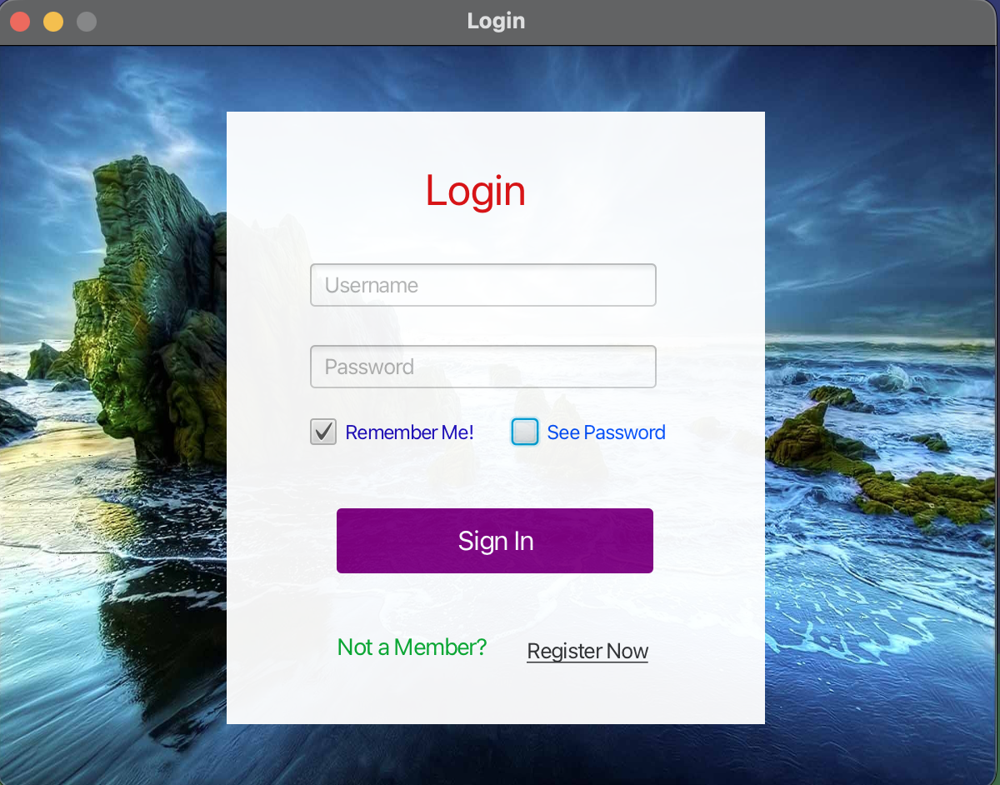

<p align="center">
    
</p>
<p align="center"><h1 align="center">CHAT-APP-FRONTEND</h1></p>
<p align="center">
	
	
	
	
</p>
<br>

# Chat App Frontend

*** Built chat app in 2020 with PHP/JavaFX. In 2024, I modernized it to Spring Boot REST API as part of my System Architecture studies. Currently refactoring to implement proper service layer, security, and MVVM pattern. The migration taught me about architectural evolution and the importance of separation of concerns.***

This is a messaging application built with Java and JavaFX. Users can register themselves and add their friends on the platform, exactly like any other messaging app like WhatsApp and Messenger. This repository contains the frontend code of the application, aimed for desktop usage purposes.

## Screenshots

### Login Screen


### Main Chat Interface


### Settings


## Table of Contents
- [Features](#features)
- [Technologies Used](#technologies-used)
- [Project Setup and Installation](#project-setup-and-installation)
- [Usage](#usage)
- [Contributing](#contributing)
- [License](#license)
- [Contact Information](#contact-information)

## Features
- User Registration and Login
- Adding Friends
- Changing Profile Picture
- Messaging
- Register Controllers

## Technologies Used
- Java
- JavaFX

## Project Structure
```sh
└── Chat-App-Frontend/
    ├── README.md
    ├── chatapp.iml
    ├── out
    │   ├── artifacts
    │   │   ├── chatapp_jar
    │   │   │   └── chatapp.jar
    │   │   └── chatapplication
    │   │       └── chatapplication.jar
    │   └── production
    │       └── chatapp
    │           ├── META-INF
    │           │   └── MANIFEST.MF
    │           └── goksoft
    │               └── chat
    └── src
        ├── META-INF
        │   └── MANIFEST.MF
        └── goksoft
            └── chat
                └── app
                    ├── ContactPanelController.java
                    ├── ControllerRules.java
                    ├── ErrorClass
                    ├── Function.java
                    ├── GUIComponents.java
                    ├── GlobalVariables.java
                    ├── Launcher.java
                    ├── LoginController.java
                    ├── Main.java
                    ├── MainPanelController.java
                    ├── RegisterController.java
                    ├── ServerFunctions.java
                    ├── WarningWindowController.java
                    ├── images
                    ├── stylesheets
                    └── userinterfaces
```

## Project Setup and Installation

### Prerequisites
- Java Development Kit (JDK) 8 or higher
- JavaFX SDK
- An IDE such as IntelliJ IDEA or Eclipse

### Installation Steps
1. Clone the repository:
    ```bash
    git clone https://github.com/yourusername/chat-app-frontend.git
    ```
2. Open the project in your IDE.
3. Set up JavaFX SDK in your IDE.
4. Build and run the project.

## Usage
1. Launch the application.
2. Register a new user or log in with existing credentials.
3. Add friends using their username.
4. Start messaging your friends.
5. Change your profile picture from the settings menu.

## Contributing
Contributions are welcome! Please follow these steps to contribute:
1. Fork the repository.
2. Create a new branch: `git checkout -b feature/your-feature-name`.
3. Make your changes and commit them: `git commit -m 'Add some feature'`.
4. Push to the branch: `git push origin feature/your-feature-name`.
5. Open a pull request.

## License
This project is licensed under the MIT License. See the [LICENSE](LICENSE) file for details.

## Contact Information
For any questions or support, please send an email to my address.


# ☕ Java Chat Application

A real-time desktop messenger built with **JavaFX** and **Spring Boot**, featuring JWT authentication, friend management, and live messaging.

> **Portfolio Project** — This is a complete modernization of a chat app I originally built 4 years ago. The revival transforms a non-functional legacy system into a production-ready application using current best practices and modern Java architecture.

---

## ✨ Features

- **User Authentication** — Register and login with JWT token-based security and BCrypt password hashing
- **Real-Time Messaging** — Send and receive messages with automatic polling for new messages
- **Friend System** — Send, accept, and reject friend requests with a unified friendship model
- **User Search** — Find and connect with other users
- **Profile Photos** — Upload and display profile pictures
- **Notification Badges** — Visual indicators for unread messages and pending friend requests
- **Remember Me** — Optional username persistence across sessions
- **Dev/Prod Toggle** — Seamless switching between local development and cloud deployment

---

## 🛠️ Tech Stack

### Backend
| Technology | Purpose |
|---|---|
| Java 21 LTS | Language |
| Spring Boot 3.x | REST API framework |
| Spring Security | Authentication & authorization |
| JWT (JJWT 0.12.6) | Stateless token-based auth |
| BCrypt | Password hashing |
| Spring Data JPA / Hibernate | ORM & data access |
| PostgreSQL | Production database |
| H2 | Local development database |
| Railway | Cloud hosting |

### Frontend
| Technology | Purpose |
|---|---|
| Java 21 LTS | Language |
| JavaFX 21.0.5 | Desktop UI framework |
| Java HttpClient | HTTP communication (built-in) |
| Gson 2.11.0 | JSON parsing |
| SLF4J + Logback | Logging |
| CompletableFuture | Async operations |

---

## 🏗️ Architecture

### Backend — Layered Architecture

```
Client Request
    │
    ▼
┌──────────────────────┐
│   Security Filter    │  JWT validation, extract username
├──────────────────────┤
│   Controller Layer   │  REST endpoints, request routing
├──────────────────────┤
│   Service Layer      │  Business logic, validation, transactions
├──────────────────────┤
│   Repository Layer   │  Spring Data JPA, database queries
├──────────────────────┤
│   Entity Layer       │  JPA entities (User, Friendship, Message)
├──────────────────────┤
│   PostgreSQL         │  3 tables: users, friendships, messages
└──────────────────────┘
```

### Frontend — MVC with Service Layer

```
┌──────────────────────┐
│   FXML Views         │  UI layout (login, register, main panel)
├──────────────────────┤
│   Controllers        │  UI logic, event handling
├──────────────────────┤
│   UI Components      │  Reusable components (FriendBox, RequestBox, etc.)
├──────────────────────┤
│   Service Layer      │  AuthService, FriendService, MessageService, UserService
├──────────────────────┤
│   ApiClient          │  HttpClient with JWT token management
├──────────────────────┤
│   Environment Config │  Dev/Prod URL switching, timeouts, polling intervals
└──────────────────────┘
```

### Database Schema

```
┌─────────────────┐       ┌──────────────────┐       ┌─────────────────┐
│     USERS       │       │   FRIENDSHIPS    │       │    MESSAGES     │
│─────────────────│       │──────────────────│       │─────────────────│
│ username (PK)   │◄──────│ user1 (FK)       │       │ id (PK)         │
│ password        │◄──────│ user2 (FK)       │       │ sender (FK) ────│──► users
│ photo           │◄──────│ initiated_by (FK)│       │ receiver (FK) ──│──► users
│ created_at      │       │ status (ENUM)    │       │ content         │
│ updated_at      │       │ created_at       │       │ is_read         │
└─────────────────┘       │ updated_at       │       │ created_at      │
                          └──────────────────┘       └─────────────────┘

Friendship Status: PENDING → ACCEPTED / REJECTED
```

---

## 🚀 Getting Started

### Prerequisites

- **Java 21** (LTS) — [Download](https://jdk.java.net/21/)
- **Maven 3.9+** — [Download](https://maven.apache.org/)
- **PostgreSQL** (for production) or H2 runs automatically for local dev
- **IntelliJ IDEA** recommended

### Clone the Repository

```bash
git clone https://github.com/yourusername/Java-ChatApp.git
cd Java-ChatApp
```

### Backend Setup

1. **Navigate to backend:**
   ```bash
   cd backend-springboot
   ```

2. **Configure environment variables** (or use `application.properties`):
   ```properties
   spring.datasource.url=jdbc:postgresql://localhost:5432/chat_app
   spring.datasource.username=your_username
   spring.datasource.password=your_password
   ```

3. **Run the backend:**
   ```bash
   mvn spring-boot:run
   ```
   The API starts at `http://localhost:8080`.

### Frontend Setup

1. **Navigate to frontend:**
   ```bash
   cd frontend
   ```

2. **Run in development mode** (connects to `localhost:8080`):
   ```bash
   mvn javafx:run -Dapp.env=dev
   ```

   Or in IntelliJ: add VM option `-Dapp.env=dev` to your run configuration.

3. **Run in production mode** (connects to Railway deployment):
   ```bash
   mvn javafx:run
   ```

### Environment Configuration

The app uses a VM argument to switch environments:

| Mode | VM Argument | Backend URL |
|---|---|---|
| Development | `-Dapp.env=dev` | `http://localhost:8080/api` |
| Production | *(none, default)* | `https://java-chatapp-production.up.railway.app/api` |

---

## 📡 API Endpoints

All endpoints except auth require a JWT token in the `Authorization: Bearer <token>` header.

### Authentication
| Method | Endpoint | Description |
|---|---|---|
| POST | `/api/auth/register` | Register new user |
| POST | `/api/auth/login` | Login, returns JWT token |

### Friends
| Method | Endpoint | Description |
|---|---|---|
| POST | `/api/friends/get` | Get accepted friends list |
| POST | `/api/friends/requests` | Get pending friend requests |
| POST | `/api/friends/send-request?receiver=X` | Send friend request |
| POST | `/api/friends/accept?requester=X` | Accept friend request |
| POST | `/api/friends/reject?requester=X` | Reject friend request |

### Messages
| Method | Endpoint | Description |
|---|---|---|
| POST | `/api/messages/send?receiver=X&message=Y` | Send message |
| POST | `/api/messages/get?receiver=X` | Get conversation (marks as read) |
| POST | `/api/messages/check-notif?chatter=X` | Get unread count |

### Users
| Method | Endpoint | Description |
|---|---|---|
| POST | `/api/users/search?username=X` | Search users (max 20 results) |
| GET | `/api/users/photo/{username}` | Get profile photo |
| POST | `/api/users/photo` | Upload profile photo (multipart) |

All responses use a standard wrapper:
```json
{
  "success": true,
  "message": "Description",
  "data": { },
  "timestamp": "2026-01-27T10:30:00"
}
```

---

## 🔐 Security

- **JWT Authentication** — Stateless tokens with 24-hour expiry, validated on every request via `JwtAuthenticationFilter`
- **BCrypt Password Hashing** — Passwords are never stored in plain text
- **Identity from Token** — Username is extracted from the JWT on the server side; users cannot impersonate others
- **Spring Security** — All endpoints except `/api/auth/login` and `/api/auth/register` are protected
- **CORS Enabled** — Configured for cross-origin requests

---

## 📁 Project Structure

```
Java-ChatApp/
├── backend-springboot/
│   └── src/main/java/com/chatapp/backend/
│       ├── config/                    # Security, JWT, filters
│       │   ├── SecurityConfig.java
│       │   ├── JwtAuthenticationFilter.java
│       │   ├── JwtUtil.java
│       │   └── SecurityUtils.java
│       ├── controller/                # REST endpoints
│       │   ├── AuthController.java
│       │   ├── FriendController.java
│       │   ├── MessageController.java
│       │   └── UserController.java
│       ├── dto/                       # Request/Response objects
│       │   ├── request/
│       │   └── response/
│       ├── exception/                 # Global error handling
│       │   ├── GlobalExceptionHandler.java
│       │   └── ... (custom exceptions)
│       ├── model/                     # JPA entities
│       │   ├── User.java
│       │   ├── Friendship.java
│       │   └── Message.java
│       ├── repository/                # Spring Data JPA
│       └── service/                   # Business logic
│
├── frontend/
│   └── src/goksoft/chat/app/
│       ├── api/
│       │   └── ApiClient.java         # HttpClient with JWT management
│       ├── config/
│       │   └── Environment.java       # Dev/Prod configuration
│       ├── controller/
│       │   ├── auth/                  # Login, Register
│       │   ├── main/                  # Main panel
│       │   └── dialog/                # Warning dialogs
│       ├── model/dto/                 # DTOs (ApiResponse, User, Message, etc.)
│       ├── service/                   # Service layer (mirrors backend)
│       │   ├── ServiceManager.java    # Singleton service locator
│       │   ├── AuthService.java
│       │   ├── FriendService.java
│       │   ├── MessageService.java
│       │   └── UserService.java
│       ├── ui/components/             # Reusable UI components
│       │   ├── FriendBoxComponent.java
│       │   ├── RequestBoxComponent.java
│       │   ├── UserBoxComponent.java
│       │   └── ProfilePhotoLoader.java
│       ├── util/                      # Utilities
│       │   ├── JsonUtil.java
│       │   ├── SceneUtil.java
│       │   └── UIUtil.java
│       └── view/                      # FXML layouts
│           ├── auth/
│           ├── main/
│           └── dialog/
│
└── README.md
```

---

## 🔄 The Modernization Story

This project is a revival of a chat application I originally built in 2020 as one of my first coding projects. The original app stopped working due to Heroku discontinuing its free tier and platform incompatibilities with Apple Silicon.

### What Changed

| Aspect | Original (2020) | Modernized (2026) |
|---|---|---|
| **Backend Language** | PHP | Java 21 (Spring Boot) |
| **Database** | MySQL on Heroku ClearDB | PostgreSQL on Railway |
| **Authentication** | Session cookies | JWT tokens + BCrypt |
| **API Style** | Individual PHP files | Layered REST API |
| **Frontend HTTP** | Manual `HttpURLConnection` | Java 11+ `HttpClient` |
| **JSON Parsing** | Manual / json-simple | Gson with generics |
| **Async Pattern** | Daemon threads + `Thread.sleep()` | `CompletableFuture` + `ScheduledExecutorService` |
| **Architecture** | Everything in one place | Clean separation of concerns |
| **Error Handling** | `try-catch` with `printStackTrace()` | Global exception handler + SLF4J logging |
| **Database Schema** | 5 tables with redundancy | 3 normalized tables |
| **Code Structure** | 700-line God class | Focused classes, ~50-150 lines each |
| **Hosting** | Heroku (defunct free tier) | Railway (cloud platform) |

### Key Refactoring Highlights

- **93% reduction in God class** — A 700-line `Function.java` that mixed UI, networking, and business logic was broken into focused services and utility classes
- **Eliminated global static state** — Replaced mutable `GlobalVariables` with `ServiceManager` singleton and proper instance state
- **Modern async patterns** — Replaced manual daemon threads with `ScheduledExecutorService` and `CompletableFuture`
- **Unified friendship model** — Consolidated separate `friends` and `requeststable` tables into a single `friendships` table with a status enum (`PENDING → ACCEPTED / REJECTED`)
- **Proper security** — JWT tokens prevent impersonation attacks that were possible with the old cookie-based system

---

## 🎓 Skills Demonstrated

- Modern Java 21 features and patterns
- REST API design and consumption
- JWT authentication (full-stack implementation)
- Async programming with `CompletableFuture`
- Clean architecture and separation of concerns
- Database design and normalization
- Cloud deployment (Railway)
- Legacy code refactoring
- JavaFX desktop application development
- Git version control and project management

---

## 📄 License

This is a personal portfolio project developed for educational purposes.

---

*Built by Jakob — University of Oslo, Programming and System Architecture*
