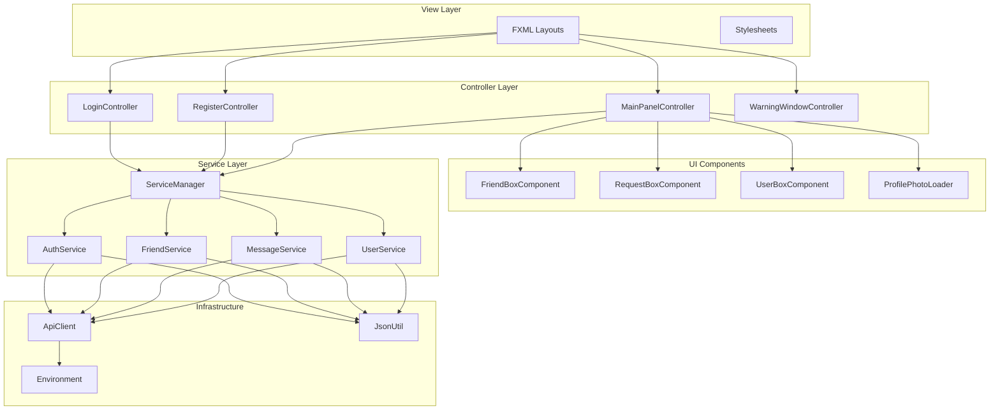
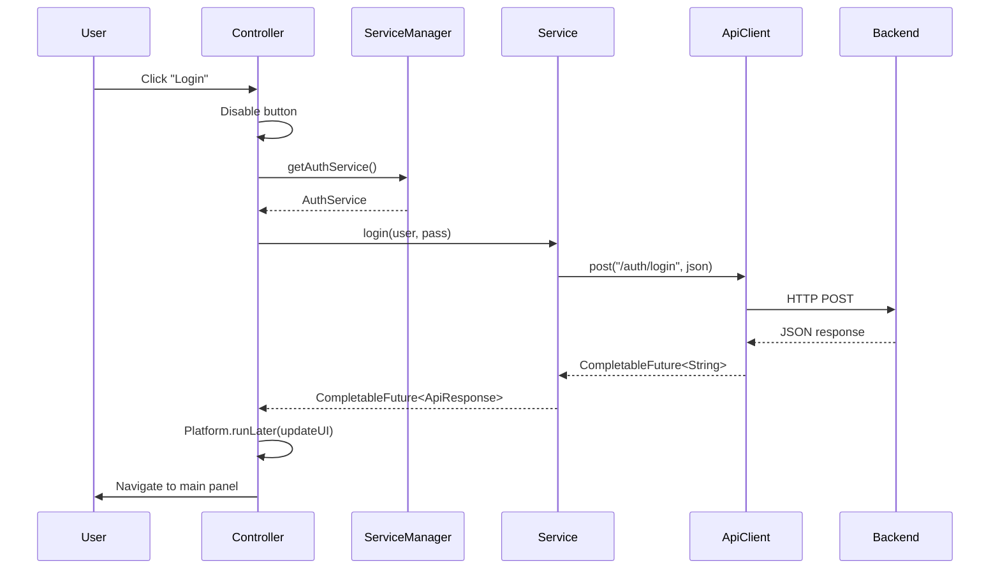
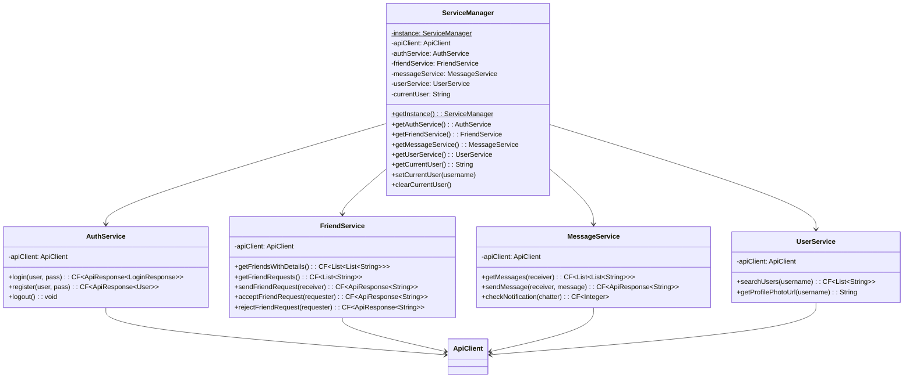
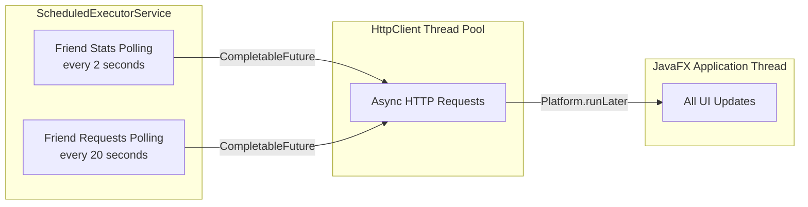
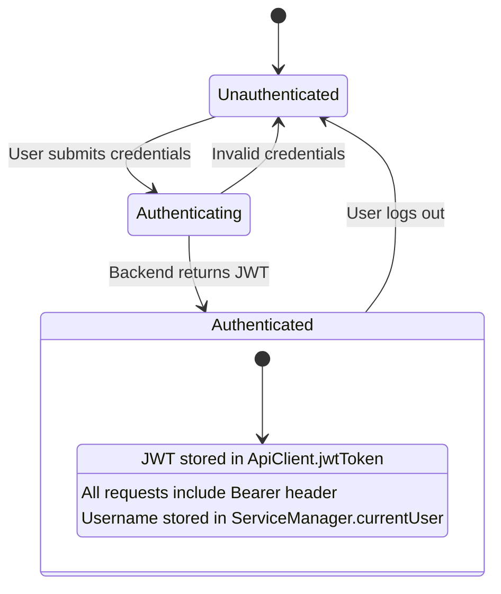

# Frontend Architecture Documentation

## Overview

The frontend is a JavaFX 21 desktop application that communicates with the Spring Boot backend over HTTP REST. It follows an **MVC with Service Layer** pattern, where FXML views define layout, controllers handle UI events, and a dedicated service layer manages all network communication asynchronously using `CompletableFuture`.

The architecture was designed during a modernization effort that replaced tightly coupled legacy code (a 700-line God class, global static state, manual daemon threads) with focused, testable components that each have a single responsibility.

---

## Layer Diagram



---

## Layer Details

### 1. View Layer (`resources/userinterfaces/`)

FXML files define the UI structure declaratively. Each file is paired with a controller class via the `fx:controller` attribute. Stylesheets handle visual presentation.

| View | Controller | Purpose |
|---|---|---|
| `login-view.fxml` | `LoginController` | Login form with username, password, remember-me |
| `register-view.fxml` | `RegisterController` | Registration form |
| `main-panel.fxml` | `MainPanelController` | Primary interface — sidebar, chat area, settings |
| `warning-window.fxml` | `WarningWindowController` | Modal dialogs for success/error feedback |

Views contain no logic. All event handling is delegated to controllers through `@FXML`-annotated methods.

---

### 2. Controller Layer (`controller/`)

Controllers receive user interactions from the views and coordinate between the UI and the service layer. Every controller accesses services through `ServiceManager.getInstance()` — never directly through `ApiClient`.



**Key responsibilities:**

- `LoginController` — Validates input, calls `AuthService.login()`, stores username in preferences if "Remember Me" is checked, navigates to main panel on success.
- `RegisterController` — Calls `AuthService.register()`, shows error/success feedback, navigates to login on success.
- `MainPanelController` — The largest controller. Manages the friends list, chat messages, friend requests, user search, profile photos, and settings. Owns two `ScheduledExecutorService` instances for polling and shuts them down on window close.
- `WarningWindowController` — Static utility for showing modal success/error popups.

**Threading rule:** All service calls return `CompletableFuture`. Controllers always use `Platform.runLater()` inside `.thenAccept()` or `.exceptionally()` to update the UI on the JavaFX Application Thread.

---

### 3. UI Components (`ui/components/`)

Reusable factory classes that build complex JavaFX nodes programmatically. Each component returns a ready-to-use `BorderPane` or `HBox` and accepts callbacks for user interaction, keeping business logic out of the component itself.

| Component | Returns | Used By | Purpose |
|---|---|---|---|
| `FriendBoxComponent` | `BorderPane` | `MainPanelController` | Friend list item with avatar, last message, unread badge, timestamp |
| `RequestBoxComponent` | `BorderPane` | `MainPanelController` | Friend request with accept/reject buttons |
| `UserBoxComponent` | `HBox` | `MainPanelController` | Search result with "Add Friend" button |
| `ProfilePhotoLoader` | `Image` | All components | Loads profile photos from backend URL, returns default avatar on failure |

Components are pure rendering functions. They receive data and event handlers as parameters and never call services directly.

---

### 4. Service Layer (`service/`)

The service layer mirrors the backend's API surface. Each service class wraps a group of related endpoints and handles JSON serialization, response parsing, and error recovery. All network-facing methods return `CompletableFuture` for non-blocking execution.



`CF` = `CompletableFuture`. All services use constructor injection — they receive the shared `ApiClient` instance from `ServiceManager`, ensuring a single JWT token is used across the entire application.

---

### 5. Infrastructure Layer

**`ApiClient`** — Thin HTTP wrapper around Java's built-in `HttpClient`. Manages the JWT token lifecycle and injects the `Authorization: Bearer <token>` header automatically on every request. Provides two methods: `get(endpoint)` and `post(endpoint, jsonBody)`, both returning `CompletableFuture<String>`.

**`Environment`** — Centralized configuration. Reads the `app.env` system property to select between development (`localhost:8080`) and production (Railway) URLs. All timeouts and polling intervals are defined as constants here, making it the single source of truth for runtime configuration.

**`JsonUtil`** — Gson wrapper that provides `toJson(object)` and `fromJson(json, type)` with `TypeToken` support for generic types like `ApiResponse<LoginResponse>` and `List<List<String>>`.

---

## Request–Response Flow

Every API interaction follows the same pattern, from user action to UI update:

```mermaid
flowchart LR
    A[User Action] --> B[Controller]
    B --> C[Service Method]
    C --> D[ApiClient.post]
    D --> E[HttpClient.sendAsync]
    E --> F[Backend REST API]
    F --> G[JSON Response]
    G --> H[JsonUtil.fromJson]
    H --> I[CompletableFuture resolves]
    I --> J["Platform.runLater()"]
    J --> K[UI Updated]

    style A fill:#e1f5fe
    style F fill:#e8f5e9
    style K fill:#e1f5fe
```



Error handling at each stage:

1. **Network failure** — `CompletableFuture` completes exceptionally. The `.exceptionally()` handler in the service returns a fallback value (empty list or error `ApiResponse`).
2. **Backend error response** — `ApiResponse.isSuccess()` returns `false`. The controller reads `ApiResponse.getMessage()` and shows it in the UI.
3. **JSON parse failure** — Caught inside the service's `.thenApply()`. Falls back to an empty result with a logged warning.

---

## Concurrency Model

The frontend uses three categories of threads:



**JavaFX Application Thread** — The only thread allowed to modify UI nodes. All `CompletableFuture` callbacks that touch the UI must be wrapped in `Platform.runLater()`.

**HttpClient thread pool** — Managed internally by `java.net.http.HttpClient`. Executes `sendAsync` operations. The pool is created once in the `ApiClient` constructor and reused for the application's lifetime.

**ScheduledExecutorService** — Owned by `MainPanelController`. Runs two periodic tasks for polling friend stats and friend requests. The scheduler is shut down cleanly when the main window closes via `cleanup()`.

---

## Authentication Architecture



The JWT token lives in memory only — it is stored as a field on the `ApiClient` instance, not persisted to disk. On successful login, `AuthService` calls `apiClient.setToken(token)` and the token is automatically attached to every subsequent request. On logout, `AuthService.logout()` calls `apiClient.clearToken()`, and the controller navigates back to the login screen.

The "Remember Me" feature only persists the username (via Java `Preferences` API), never the token or password.

---

## Design Patterns

### Singleton — ServiceManager

`ServiceManager` uses double-checked locking (`synchronized`) to guarantee a single instance. This ensures all controllers share the same `ApiClient` (and therefore the same JWT token) and the same user state.

### Factory Method — UI Components

`FriendBoxComponent.create()`, `RequestBoxComponent.create()`, and `UserBoxComponent.create()` are static factory methods that encapsulate complex node construction. Callers pass data and callbacks; the factory handles layout, styling, and event wiring.

### Observer — JavaFX Properties and FXML Bindings

FXML `@FXML`-annotated fields are injected by the `FXMLLoader`, and JavaFX property listeners (e.g., `sceneProperty().addListener(...)`) are used for lifecycle events like detecting window close to trigger polling cleanup.

### Strategy — Error Recovery

Each service method has its own `.exceptionally()` handler that defines a recovery strategy: `AuthService` returns an error `ApiResponse`, `FriendService` and `MessageService` return empty lists, and `UserService` returns an empty list. This means the UI always receives a usable value and never has to handle raw exceptions.

---

## Key Architectural Decisions

### 1. HttpClient over Retrofit

Java 11's built-in `HttpClient` was chosen over Retrofit/OkHttp. With only ~10 endpoints, Retrofit's interface-based abstraction adds complexity without proportional benefit. The built-in client means fewer dependencies, simpler debugging, and no annotation processing.

### 2. CompletableFuture over daemon threads

The legacy code used raw daemon threads with `while(true) { Thread.sleep(...) }` loops. The modernized code uses `CompletableFuture` for one-off requests and `ScheduledExecutorService` for polling, providing proper cancellation, error handling, and thread pool management.

### 3. ServiceManager singleton over dependency injection framework

A full DI framework (Spring, Guice) would be overkill for a desktop app with ~5 services. The `ServiceManager` singleton provides the same benefit — centralized wiring with a shared `ApiClient` — without framework overhead.

### 4. Platform.runLater() discipline

Every `CompletableFuture` callback that touches the UI is wrapped in `Platform.runLater()`. This is not optional — JavaFX throws `IllegalStateException` if UI nodes are modified from a non-FX thread. The pattern is enforced by convention across all controllers.

### 5. Polling over WebSocket

The app uses HTTP polling (2-second intervals for messages, 20-second for friend requests) rather than WebSocket push. This was a deliberate simplicity trade-off: polling works reliably through all network configurations, requires no additional server infrastructure, and is straightforward to implement and debug. The polling intervals are configurable in `Environment.java` for easy tuning.

---

## File Map

```
frontend/src/goksoft/chat/app/
├── api/
│   └── ApiClient.java              # HTTP client, JWT token management
├── config/
│   └── Environment.java            # Dev/prod URLs, timeouts, polling intervals
├── controller/
│   ├── auth/
│   │   ├── LoginController.java    # Login flow, remember-me
│   │   └── RegisterController.java # Registration flow
│   ├── main/
│   │   └── MainPanelController.java # Chat, friends, search, settings, polling
│   └── dialog/
│       └── WarningWindowController.java # Modal popups
├── model/dto/
│   ├── ApiResponse.java            # Generic API response wrapper
│   ├── LoginRequest.java           # Login credentials
│   ├── LoginResponse.java          # JWT token + user
│   ├── RegisterRequest.java        # Registration data
│   ├── User.java                   # User identity
│   └── Message.java                # Chat message
├── service/
│   ├── ServiceManager.java         # Singleton service locator
│   ├── AuthService.java            # Login, register, logout
│   ├── FriendService.java          # Friends, requests
│   ├── MessageService.java         # Messages, notifications
│   └── UserService.java            # User search, profile photos
├── ui/components/
│   ├── FriendBoxComponent.java     # Friend list item
│   ├── RequestBoxComponent.java    # Friend request item
│   ├── UserBoxComponent.java       # Search result item
│   └── ProfilePhotoLoader.java     # Profile photo fetching
├── util/
│   ├── JsonUtil.java               # Gson serialization wrapper
│   ├── SceneUtil.java              # FXML scene loading helpers
│   └── UIUtil.java                 # UI utility methods
├── error/
│   ├── Result.java                 # Base result class
│   ├── ErrorResult.java            # Error popup trigger
│   └── SuccessResult.java          # Success popup trigger
└── resources/
    ├── userinterfaces/             # FXML layouts
    ├── stylesheets/                # CSS files
    └── images/                     # Icons, default avatars
```
