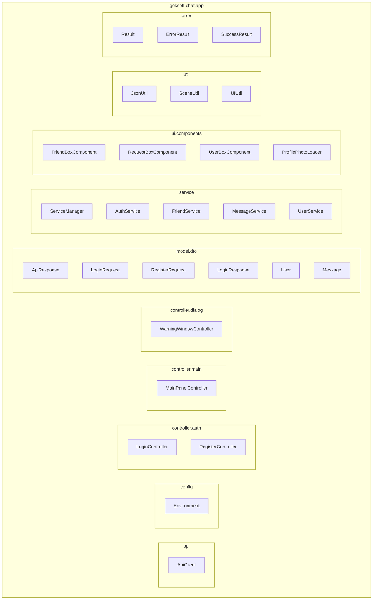
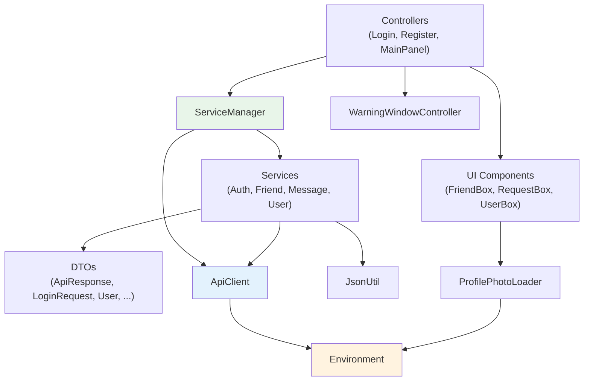

# Class Diagram

## Overview

This document presents the full class structure of the JavaFX chat application frontend. The diagram is split into logical sections matching the package layout: controllers, services, data models, UI components, infrastructure, and utilities.

---

## Full Class Diagram

```mermaid
classDiagram
    direction TB

    %% ===== SERVICE LAYER =====

    class ServiceManager {
        -instance: ServiceManager$
        -apiClient: ApiClient
        -authService: AuthService
        -friendService: FriendService
        -messageService: MessageService
        -userService: UserService
        -currentUser: String
        +getInstance(): ServiceManager$
        +getApiClient(): ApiClient
        +getAuthService(): AuthService
        +getFriendService(): FriendService
        +getMessageService(): MessageService
        +getUserService(): UserService
        +getCurrentUser(): String
        +setCurrentUser(String)
        +clearCurrentUser()
    }

    class AuthService {
        -logger: Logger
        -apiClient: ApiClient
        +AuthService(ApiClient)
        +login(String, String): CF~ApiResponse~LoginResponse~~
        +register(String, String): CF~ApiResponse~User~~
        +logout(): void
    }

    class FriendService {
        -logger: Logger
        -apiClient: ApiClient
        +FriendService(ApiClient)
        +getFriendsWithDetails(): CF~List~List~String~~~
        +getFriendRequests(): CF~List~String~~
        +sendFriendRequest(String): CF~ApiResponse~String~~
        +acceptFriendRequest(String): CF~ApiResponse~String~~
        +rejectFriendRequest(String): CF~ApiResponse~String~~
    }

    class MessageService {
        -logger: Logger
        -apiClient: ApiClient
        +MessageService(ApiClient)
        +getMessages(String): CF~List~List~String~~~
        +sendMessage(String, String): CF~ApiResponse~String~~
        +checkNotification(String): CF~Integer~
    }

    class UserService {
        -logger: Logger
        -apiClient: ApiClient
        +UserService(ApiClient)
        +searchUsers(String): CF~List~String~~
        +getProfilePhotoUrl(String): String
    }

    ServiceManager --> AuthService
    ServiceManager --> FriendService
    ServiceManager --> MessageService
    ServiceManager --> UserService
    ServiceManager --> ApiClient
    AuthService --> ApiClient
    FriendService --> ApiClient
    MessageService --> ApiClient
    UserService --> ApiClient

    %% ===== INFRASTRUCTURE =====

    class ApiClient {
        -client: HttpClient
        -jwtToken: String
        +ApiClient()
        +get(String): CF~String~
        +post(String, String): CF~String~
        +getToken(): String
        +setToken(String)
        +hasToken(): boolean
        +clearToken()
        -buildRequest(String): HttpRequest.Builder
    }

    class Environment {
        +CONNECT_TIMEOUT_SECONDS: int$
        +REQUEST_TIMEOUT_SECONDS: int$
        +MESSAGE_POLL_INTERVAL_MS: int$
        +FRIEND_REQUEST_POLL_INTERVAL_MS: int$
        -PROD_URL: String$
        -DEV_URL: String$
        +isProduction(): boolean$
        +getBaseUrl(): String$
        +getServerUrl(): String$
        +getEnvironmentName(): String$
    }

    class JsonUtil {
        -gson: Gson$
        +toJson(Object): String$
        +fromJson(String, Class~T~): T$
        +fromJson(String, TypeToken~T~): T$
    }

    ApiClient --> Environment

    %% ===== CONTROLLERS =====

    class LoginController {
        -serviceManager: ServiceManager
        -usernameField: TextField
        -passwordField: PasswordField
        -rememberMeCheckbox: CheckBox
        -signInButton: Button
        +initialize()
        +signIn(): Result
        -loadMainPanel()
        -loadRememberedUsername()
        -saveUsername(String)
    }

    class RegisterController {
        -serviceManager: ServiceManager
        -usernameField: TextField
        -passwordField: PasswordField
        -registerButton: Button
        +initialize()
        +register()
        -navigateToLogin()
    }

    class MainPanelController {
        -logger: Logger
        -serviceManager: ServiceManager
        -scheduler: ScheduledExecutorService
        -messagePollingScheduler: ScheduledExecutorService
        -currentFriend: String
        -currentPane: BorderPane
        -friendsNameList: ArrayList~String~
        -friendRequestsNameList: ArrayList~String~
        -friendArray: List~Object~
        +initialize()
        -loadFriends()
        -loadFriendRequests()
        -startFriendStatsPolling()
        -startFriendRequestsPolling()
        -onFriendClicked(Image, String, BorderPane)
        -loadMessages(String)
        +sendMessage()
        +searchUsers(KeyEvent)
        -sendFriendRequest(String)
        -acceptFriendRequest(String)
        -rejectFriendRequest(String)
        -loadProfilePhoto(boolean)
        +changeProfilePhoto(MouseEvent)
        +openSettings()
        +logout()
        -cleanup()
    }

    class WarningWindowController {
        +warningMessage(String)$
    }

    LoginController --> ServiceManager
    RegisterController --> ServiceManager
    MainPanelController --> ServiceManager
    MainPanelController --> FriendBoxComponent
    MainPanelController --> RequestBoxComponent
    MainPanelController --> UserBoxComponent
    MainPanelController --> ProfilePhotoLoader
    MainPanelController --> WarningWindowController
    LoginController ..> WarningWindowController

    %% ===== DATA MODEL (DTOs) =====

    class ApiResponse~T~ {
        -success: boolean
        -message: String
        -data: T
        +ApiResponse()
        +ApiResponse(boolean, String, T)
        +isSuccess(): boolean
        +getMessage(): String
        +getData(): T
    }

    class LoginRequest {
        -username: String
        -password: String
        +LoginRequest()
        +LoginRequest(String, String)
        +getUsername(): String
        +getPassword(): String
    }

    class RegisterRequest {
        -username: String
        -email: String
        -password: String
        +RegisterRequest()
        +RegisterRequest(String, String, String)
        +getUsername(): String
        +getPassword(): String
    }

    class LoginResponse {
        -token: String
        -user: User
        +LoginResponse()
        +LoginResponse(String, User)
        +getToken(): String
        +getUser(): User
    }

    class User {
        -id: Long
        -username: String
        +User()
        +User(Long, String)
        +getId(): Long
        +getUsername(): String
    }

    class Message {
        -id: Long
        -sender: String
        -receiver: String
        -content: String
        -timestamp: String
    }

    LoginResponse --> User
    AuthService ..> LoginRequest : creates
    AuthService ..> RegisterRequest : creates
    AuthService ..> ApiResponse : returns
    AuthService ..> LoginResponse : deserializes
    FriendService ..> ApiResponse : returns
    MessageService ..> ApiResponse : returns

    %% ===== UI COMPONENTS =====

    class FriendBoxComponent {
        +create(String, String, String, String, Image, Runnable): BorderPane$
    }

    class RequestBoxComponent {
        +create(String, Image, EventHandler, EventHandler): BorderPane$
    }

    class UserBoxComponent {
        +create(String, Image, EventHandler): HBox$
    }

    class ProfilePhotoLoader {
        +loadPhoto(String): Image$
    }

    FriendBoxComponent ..> ProfilePhotoLoader
    RequestBoxComponent ..> ProfilePhotoLoader
    UserBoxComponent ..> ProfilePhotoLoader

    %% ===== UTILITIES =====

    class SceneUtil {
        +loadScene(String): void$
    }

    class UIUtil {
        +utility methods$
    }

    %% ===== ERROR HANDLING =====

    class Result {
        <<abstract>>
    }

    class ErrorResult {
        +ErrorResult(String)
    }

    class SuccessResult {
        +SuccessResult(String)
    }

    ErrorResult --|> Result
    SuccessResult --|> Result
    LoginController ..> Result : returns
```

---

## Package Breakdown

The class diagram above maps to the following package organization:

---

## Relationship Legend

| Arrow | Meaning | Example |
|---|---|---|
| `──>` (solid) | **Composition / ownership** — the source creates and holds a reference to the target | `ServiceManager ──> AuthService` |
| `..>` (dashed) | **Dependency / usage** — the source uses the target but doesn't own it | `AuthService ..> LoginRequest` (creates temporarily) |
| `──\|>` (solid with triangle) | **Inheritance** — the source extends or implements the target | `ErrorResult ──\|> Result` |

---

## Key Class Responsibilities

### Controllers

| Class | FXML View | Responsibility |
|---|---|---|
| `LoginController` | `login-view.fxml` | Handles login form, validates input, calls `AuthService.login()`, navigates to main panel, manages "Remember Me" via `Preferences` |
| `RegisterController` | `register-view.fxml` | Handles registration form, calls `AuthService.register()`, navigates back to login on success |
| `MainPanelController` | `main-panel.fxml` | The central controller — manages three sidebar tabs (friends, requests, search), the chat area, profile photos, settings, and two polling schedulers |
| `WarningWindowController` | `warning-window.fxml` | Static factory for modal popup dialogs showing success/error messages |

### Services

| Class | Pattern | API Endpoints Covered |
|---|---|---|
| `ServiceManager` | Singleton | None (wiring only) |
| `AuthService` | Constructor injection | `/auth/login`, `/auth/register` |
| `FriendService` | Constructor injection | `/friends/get-details`, `/friends/requests`, `/friends/send-request`, `/friends/accept`, `/friends/reject` |
| `MessageService` | Constructor injection | `/messages/get`, `/messages/send`, `/messages/check-notif` |
| `UserService` | Constructor injection | `/users/search`, `/users/photo/{username}` |

### DTOs

| Class | Direction | Serialization |
|---|---|---|
| `LoginRequest` | Frontend → Backend | `JsonUtil.toJson()` into POST body |
| `RegisterRequest` | Frontend → Backend | `JsonUtil.toJson()` into POST body |
| `ApiResponse<T>` | Backend → Frontend | `JsonUtil.fromJson()` with `TypeToken` |
| `LoginResponse` | Backend → Frontend | Nested inside `ApiResponse.data` |
| `User` | Backend → Frontend | Nested inside `LoginResponse.user` |
| `Message` | *(defined, not actively used)* | Reserved for future structured message responses |

### UI Components

| Class | Returns | Parameters | Used For |
|---|---|---|---|
| `FriendBoxComponent` | `BorderPane` | username, lastMessage, notifCount, time, photo, onClick | Friend list item with avatar, preview, badge |
| `RequestBoxComponent` | `BorderPane` | username, photo, onAccept, onReject | Friend request with action buttons |
| `UserBoxComponent` | `HBox` | username, photo, onAdd | Search result with "Add Friend" button |
| `ProfilePhotoLoader` | `Image` | username | Fetches photo from backend, returns default on failure |

### Infrastructure

| Class | Responsibility |
|---|---|
| `ApiClient` | HTTP client wrapping `java.net.http.HttpClient`. Manages JWT token, injects `Authorization` header, provides async `get()` and `post()` returning `CompletableFuture<String>` |
| `Environment` | Static configuration — selects dev/prod URL based on `app.env` system property, defines all timeouts and polling intervals |
| `JsonUtil` | Static Gson wrapper — `toJson()` for serialization, `fromJson()` with both `Class<T>` and `TypeToken<T>` overloads for deserialization |

---

## Dependency Graph (Simplified)

This shows the top-level dependency direction — every arrow means "depends on" or "uses":

The dependency flow is strictly top-down: controllers depend on services, services depend on infrastructure, and nothing points back upward. This makes each layer independently testable — services can be tested by mocking `ApiClient`, and controllers can be tested by mocking `ServiceManager`.

---

## Class Count Summary

| Package | Classes | Description |
|---|---|---|
| `controller.auth` | 2 | Login, Register |
| `controller.main` | 1 | MainPanelController |
| `controller.dialog` | 1 | WarningWindowController |
| `service` | 5 | ServiceManager + 4 domain services |
| `model.dto` | 6 | ApiResponse, LoginRequest, RegisterRequest, LoginResponse, User, Message |
| `ui.components` | 4 | FriendBox, RequestBox, UserBox, ProfilePhotoLoader |
| `api` | 1 | ApiClient |
| `config` | 1 | Environment |
| `util` | 3 | JsonUtil, SceneUtil, UIUtil |
| `error` | 3 | Result, ErrorResult, SuccessResult |
| **Total** | **27** | |
