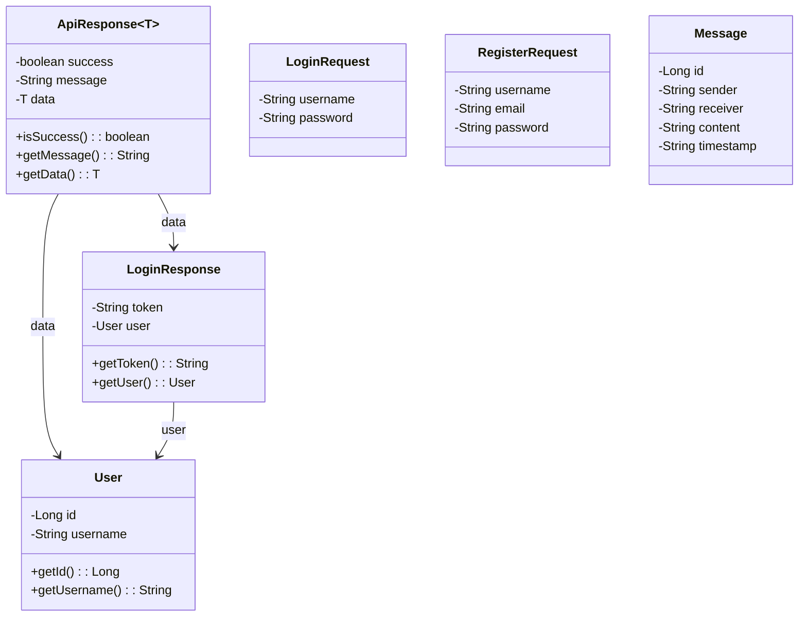
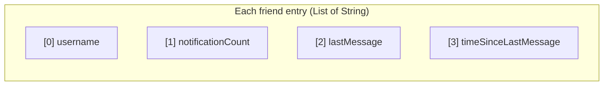
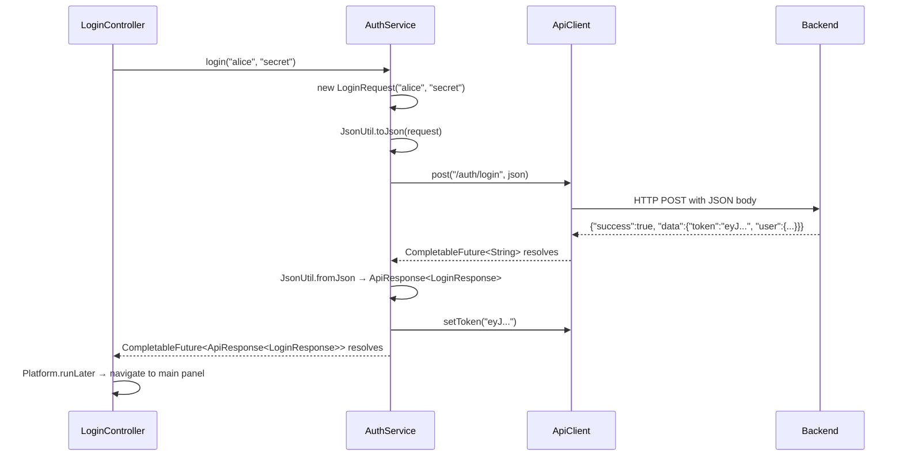
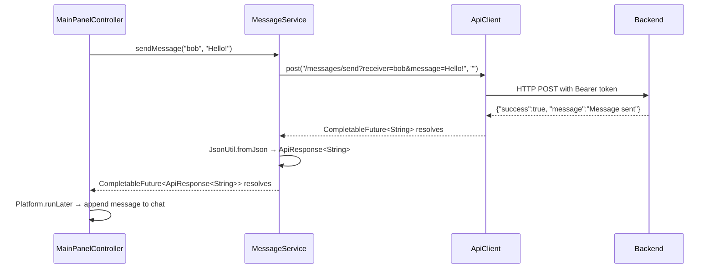
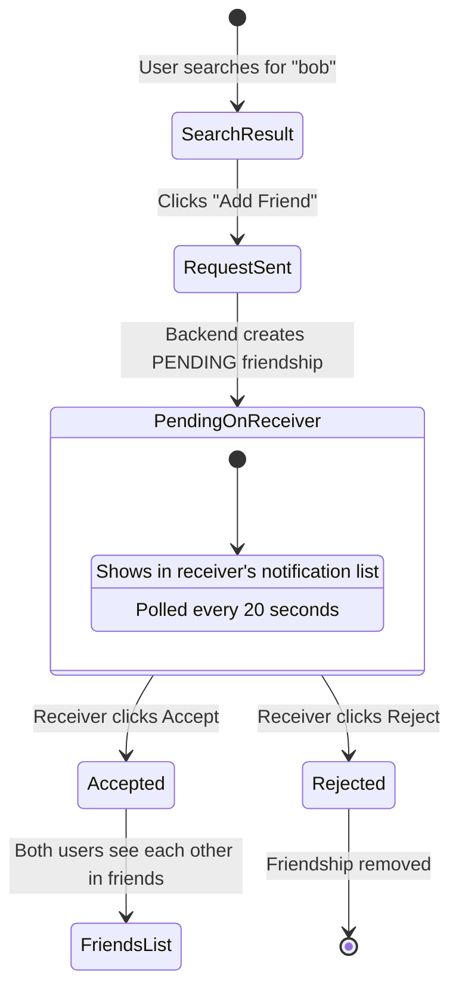
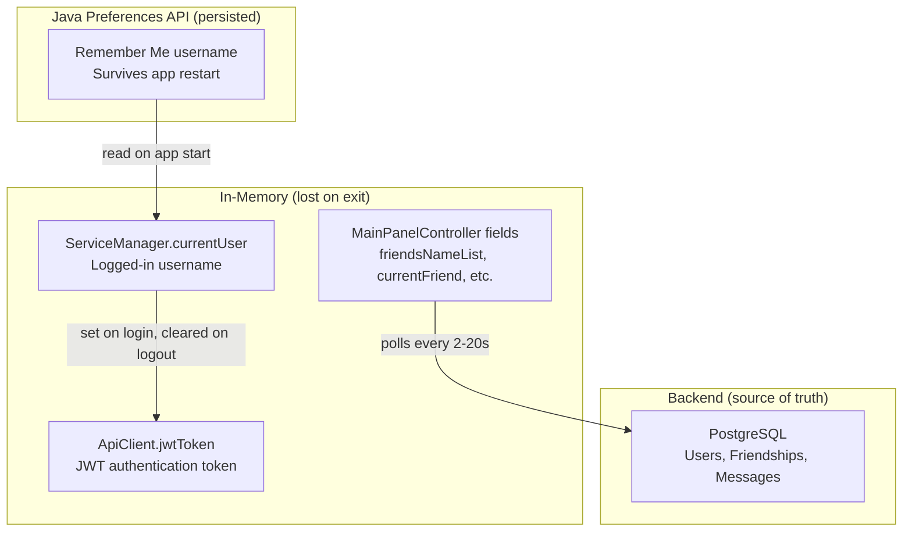

# Frontend Data Modeling Documentation

## Overview

The frontend data model consists of **DTOs** (Data Transfer Objects) that mirror the backend's API contract, and **service-level data structures** used for internal state management. Unlike the backend, the frontend has no ORM or database — its models exist solely to serialize requests, deserialize responses, and carry data between layers.

All DTOs live in `goksoft.chat.app.model.dto` and use standard Java classes with getters/setters (not records) to maintain Gson compatibility for generic type deserialization.

---

## Class Diagram



---

## DTO Reference

### ApiResponse\<T\>

The universal response wrapper. Every backend endpoint returns this structure, and the frontend deserializes it to check success/failure before accessing the payload.

| Field | Type | Description |
|---|---|---|
| `success` | `boolean` | Whether the operation succeeded |
| `message` | `String` | Human-readable status message |
| `data` | `T` | The payload — type varies by endpoint |

**Usage across services:**

| Service Method | T resolves to | Example |
|---|---|---|
| `AuthService.login()` | `LoginResponse` | `ApiResponse<LoginResponse>` |
| `AuthService.register()` | `User` | `ApiResponse<User>` |
| `FriendService.sendFriendRequest()` | `String` | `ApiResponse<String>` |
| `FriendService.acceptFriendRequest()` | `String` | `ApiResponse<String>` |
| `FriendService.rejectFriendRequest()` | `String` | `ApiResponse<String>` |
| `MessageService.sendMessage()` | `String` | `ApiResponse<String>` |

**Design notes:**

- The no-arg constructor is required for Gson deserialization.
- The three-arg constructor `ApiResponse(boolean, String, T)` is used in `.exceptionally()` handlers to build fallback error responses client-side when the network fails.
- `toString()` is overridden for logging.

```java
// Successful response from backend
ApiResponse<LoginResponse> response = JsonUtil.fromJson(json,
    new TypeToken<ApiResponse<LoginResponse>>() {});

if (response.isSuccess()) {
    String token = response.getData().getToken();
}

// Client-side error fallback
return new ApiResponse<>(false, "Connection error: " + ex.getMessage(), null);
```

---

### LoginRequest

Sent to `POST /api/auth/login` as the JSON request body.

| Field | Type | Serialized as | Required |
|---|---|---|---|
| `username` | `String` | `"username"` | Yes |
| `password` | `String` | `"password"` | Yes |

```json
{ "username": "alice", "password": "secret123" }
```

---

### RegisterRequest

Sent to `POST /api/auth/register` as the JSON request body.

| Field | Type | Serialized as | Required |
|---|---|---|---|
| `username` | `String` | `"username"` | Yes |
| `email` | `String` | `"email"` | No (nullable) |
| `password` | `String` | `"password"` | Yes |

The `email` field is always passed as `null` in the current implementation since the registration form only collects username and password. The field exists to match the backend's `RegisterRequest` DTO.

```json
{ "username": "alice", "email": null, "password": "secret123" }
```

---

### LoginResponse

Returned inside `ApiResponse.data` from `POST /api/auth/login` on success.

| Field | Type | Description |
|---|---|---|
| `token` | `String` | JWT token (24-hour expiry) |
| `user` | `User` | The authenticated user's identity |

This is the only DTO that triggers a side effect on deserialization — `AuthService.login()` reads `getToken()` from this object and passes it to `ApiClient.setToken()` to enable authenticated requests.

```json
{
  "token": "eyJhbGciOiJIUzI1NiJ9.eyJzdWIiOiJhbGljZSIs...",
  "user": { "id": 1, "username": "alice" }
}
```

---

### User

Represents a user account. Used both as the nested user inside `LoginResponse` and as the standalone payload in registration responses.

| Field | Type | Description |
|---|---|---|
| `id` | `Long` | Database primary key |
| `username` | `String` | Unique username |

The frontend `User` is intentionally minimal — it omits `password`, `photo`, and timestamp fields that exist on the backend entity, since those are never sent to the client in this form.

---

### Message

Represents a chat message. Currently defined as a DTO but not actively deserialized from the API — the message endpoints return `List<List<String>>` (see [Wire Formats](#wire-formats) below).

| Field | Type | Description |
|---|---|---|
| `id` | `Long` | Message ID |
| `sender` | `String` | Sender username |
| `receiver` | `String` | Receiver username |
| `content` | `String` | Message text |
| `timestamp` | `String` | Creation time |

This class exists for forward compatibility — if the backend migrates to returning structured `MessageResponse` objects instead of string arrays, the frontend DTO is ready.

---

## Wire Formats

Not all backend responses use the `ApiResponse<T>` wrapper. Some endpoints return raw JSON structures that the frontend deserializes directly. These are documented here because they represent implicit contracts between frontend and backend.

### Friend Details — `List<List<String>>`

**Endpoint:** `POST /api/friends/get-details`

The backend returns `ApiResponse<List<FriendDetailsResponse>>`, but `FriendService` parses the inner list into `List<List<String>>` where each inner list has 4 elements:



| Index | Content | Example |
|---|---|---|
| 0 | Friend's username | `"bob"` |
| 1 | Unread message count | `"3"` |
| 2 | Last message preview (truncated to 30 chars) | `"Hey, are you free tom..."` |
| 3 | Time since last message | `"5 min ago"` |

This format is consumed directly by `FriendBoxComponent.create()` to render the friend list items.

---

### Messages — `List<List<String>>`

**Endpoint:** `POST /api/messages/get?receiver=X`

Returns a list of message pairs, each as a two-element string list:

| Index | Content | Example |
|---|---|---|
| 0 | Sender username | `"alice"` |
| 1 | Message content | `"Hello!"` |

```json
[
  ["alice", "Hello!"],
  ["bob", "Hi there!"],
  ["alice", "How are you?"]
]
```

Messages are ordered chronologically (oldest first). The controller compares index 0 against the current user to determine message alignment (left vs right bubble).

---

### Friend Requests — `List<String>`

**Endpoint:** `POST /api/friends/requests`

Returns a flat list of usernames who have sent pending friend requests to the current user:

```json
["charlie", "diana"]
```

---

### User Search — `List<String>`

**Endpoint:** `POST /api/users/search?username=X`

Returns a flat list of matching usernames (max 20 results):

```json
["alice", "alex", "alan"]
```

---

### Notification Count — Plain Text

**Endpoint:** `POST /api/messages/check-notif?chatter=X`

Returns the unread count as a plain text integer, not wrapped in `ApiResponse`:

```
3
```

`MessageService.checkNotification()` parses this with `Integer.parseInt()` and falls back to `0` on `NumberFormatException`.

---

## Data Flow Diagrams

### Login Flow



### Send Message Flow



### Friend Request Lifecycle



---

## Serialization

All JSON serialization and deserialization goes through `JsonUtil`, which wraps Gson. The key challenge is generic type preservation — Java's type erasure means `ApiResponse<LoginResponse>.class` doesn't carry the `LoginResponse` type at runtime. Gson's `TypeToken` solves this:

```java
// Simple type — class literal works
User user = JsonUtil.fromJson(json, User.class);

// Generic type — TypeToken required
ApiResponse<LoginResponse> response = JsonUtil.fromJson(json,
    new TypeToken<ApiResponse<LoginResponse>>() {});

// Nested generic — TypeToken still works
List<List<String>> messages = JsonUtil.fromJson(json,
    new TypeToken<List<List<String>>>() {});
```

**Gson configuration:**

- Null fields are excluded from serialization (Gson default)
- Unknown fields in JSON are silently ignored during deserialization
- No custom serializers or deserializers are registered

---

## State Management

The frontend has no persistent database. Application state is managed in three locations:



| State | Location | Lifetime | Purpose |
|---|---|---|---|
| JWT token | `ApiClient.jwtToken` | Login → Logout | Authenticates all API requests |
| Current username | `ServiceManager.currentUser` | Login → Logout | Identifies the logged-in user for UI display |
| Friends list | `MainPanelController.friendsNameList` | While main panel is open | Local cache, refreshed by polling |
| Current chat partner | `MainPanelController.currentFriend` | Until user selects a different friend | Determines which conversation to display |
| Remember Me | Java `Preferences` | Across app restarts | Pre-fills the username field on login |

---

## Frontend–Backend DTO Mapping

The frontend and backend define their own DTO classes independently. This table shows how they correspond:

| Frontend DTO | Backend DTO | Notes |
|---|---|---|
| `ApiResponse<T>` | `ApiResponse<T>` | Identical structure: `success`, `message`, `data` |
| `LoginRequest` | `LoginRequest` (record) | Same fields. Backend uses Java record, frontend uses class |
| `RegisterRequest` | `RegisterRequest` (record) | Frontend always sends `email: null` |
| `LoginResponse` | `UserResponse` | Backend calls it `UserResponse` with fields `username` + `token` |
| `User` | `User` (entity) | Frontend has `id` + `username` only; backend entity has all fields |
| `Message` | `Message` (entity) | Frontend DTO exists but isn't actively used for deserialization |
| *(none)* | `FriendDetailsResponse` | Frontend receives as `List<List<String>>` via manual parsing |
| *(none)* | `MessageResponse` | Frontend receives as `List<List<String>>` via manual parsing |
| *(none)* | `ErrorResponse` | Frontend only reads `ApiResponse.success` and `ApiResponse.message` |

---

## Design Decisions

### 1. Classes over Records for DTOs

The backend uses Java 21 records for its DTOs, but the frontend uses standard classes with no-arg constructors and setters. This is required by Gson — its default deserialization strategy instantiates objects via the no-arg constructor and populates fields reflectively. Records would require a custom `TypeAdapter` for each type.

### 2. No "Dto" suffix in class names

DTOs are named `User`, `Message`, `LoginRequest` — not `UserDto`, `MessageDto`. The package name `model.dto` already communicates what they are, and shorter names produce cleaner code at call sites.

### 3. String-based wire formats for collections

`FriendService.getFriendsWithDetails()` and `MessageService.getMessages()` return `List<List<String>>` rather than typed DTOs. This matches the backend's response format and avoids creating single-use wrapper classes for data that's immediately consumed by UI components. The trade-off is less type safety, but the data is validated by position (index 0 = username, index 1 = content, etc.) and the pattern is consistent throughout.

### 4. ApiResponse constructed client-side for errors

When a network call fails, services don't throw exceptions. Instead, the `.exceptionally()` handler constructs a new `ApiResponse(false, "Connection error: ...", null)` and returns it. This means controllers always receive an `ApiResponse` and can use the same `if (response.isSuccess())` check regardless of whether the error came from the backend or the network.

### 5. Message DTO exists but isn't wired up

The `Message` class is defined in `model/dto/` but the message endpoints currently return `List<List<String>>`. The class was kept for forward compatibility — migrating to structured message responses would only require changing the `TypeToken` in `MessageService.getMessages()`.
