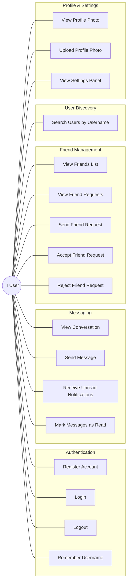
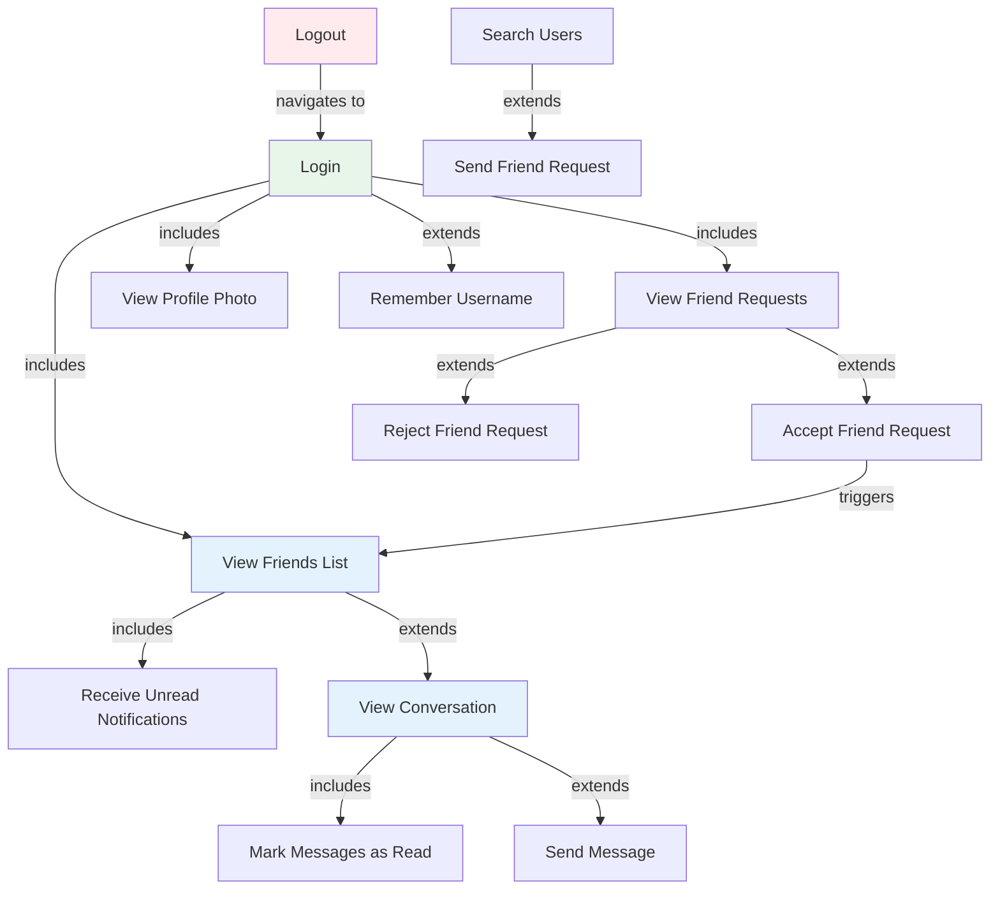
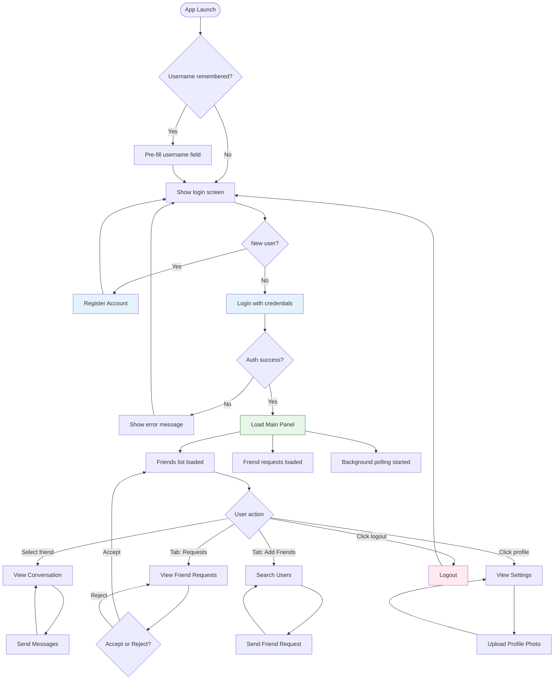
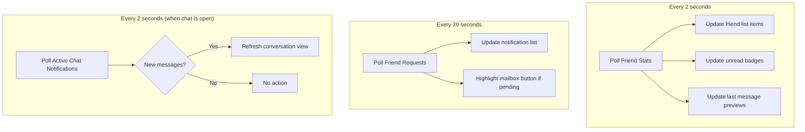

# Use Case Diagram

## Overview

This diagram captures all user-facing interactions available in the JavaFX chat application frontend. The system has a single actor — the **User** — who progresses through authentication into the main application, where they can manage friends, exchange messages, search for users, and configure their profile.

---

## Use Case Diagram

---

## Use Case Details

### Authentication

| ID | Use Case | Precondition | Postcondition | Service |
|---|---|---|---|---|
| UC1 | Register Account | None | Account created, user redirected to login | `AuthService.register()` |
| UC2 | Login | Account exists | JWT token stored, main panel loaded | `AuthService.login()` |
| UC3 | Logout | Logged in | JWT cleared, return to login screen | `AuthService.logout()` |
| UC4 | Remember Username | On login screen | Username pre-filled on next app launch | Java `Preferences` API |

### Messaging

| ID | Use Case | Precondition | Postcondition | Service |
|---|---|---|---|---|
| UC5 | View Conversation | Logged in, friend selected | Chat history displayed | `MessageService.getMessages()` |
| UC6 | Send Message | In active conversation | Message sent, appears in chat | `MessageService.sendMessage()` |
| UC7 | Receive Unread Notifications | Logged in | Badge count shown on friend list items | `MessageService.checkNotification()` |
| UC8 | Mark Messages as Read | Open conversation | Unread count resets to 0 | Automatic on `getMessages()` |

### Friend Management

| ID | Use Case | Precondition | Postcondition | Service |
|---|---|---|---|---|
| UC9 | View Friends List | Logged in | Friends displayed with last message and unread count | `FriendService.getFriendsWithDetails()` |
| UC10 | View Friend Requests | Logged in | Pending requests listed with accept/reject buttons | `FriendService.getFriendRequests()` |
| UC11 | Send Friend Request | Target user found via search | PENDING friendship created on backend | `FriendService.sendFriendRequest()` |
| UC12 | Accept Friend Request | Pending request received | Friendship status → ACCEPTED, user appears in friends list | `FriendService.acceptFriendRequest()` |
| UC13 | Reject Friend Request | Pending request received | Friendship status → REJECTED, request removed from list | `FriendService.rejectFriendRequest()` |

### User Discovery

| ID | Use Case | Precondition | Postcondition | Service |
|---|---|---|---|---|
| UC14 | Search Users by Username | Logged in, on "Add Friends" tab | Matching usernames listed with "Add" button | `UserService.searchUsers()` |

### Profile & Settings

| ID | Use Case | Precondition | Postcondition | Service |
|---|---|---|---|---|
| UC15 | View Profile Photo | Logged in | Photo displayed in sidebar and settings | `ProfilePhotoLoader.loadPhoto()` |
| UC16 | Upload Profile Photo | Logged in, in settings | Photo uploaded to backend, UI refreshed | `UserService` (upload endpoint) |
| UC17 | View Settings Panel | Logged in | Settings panel visible with username and photo | Controller navigation |

---

## Use Case Relationships

The diagram above shows how use cases relate to each other. After **Login**, the friends list and friend requests are loaded automatically (includes). Selecting a friend **extends** into viewing the conversation, which **includes** marking messages as read. The search flow **extends** into sending a friend request when the user clicks "Add."

---

## Interaction Flow

This diagram shows the typical user journey through the application from launch to active messaging:

---

## Polling Use Cases (Background)

These use cases execute automatically without direct user action, driven by `ScheduledExecutorService` in `MainPanelController`:

These background tasks are started on `MainPanelController.initialize()` and stopped on window close via `cleanup()`.
